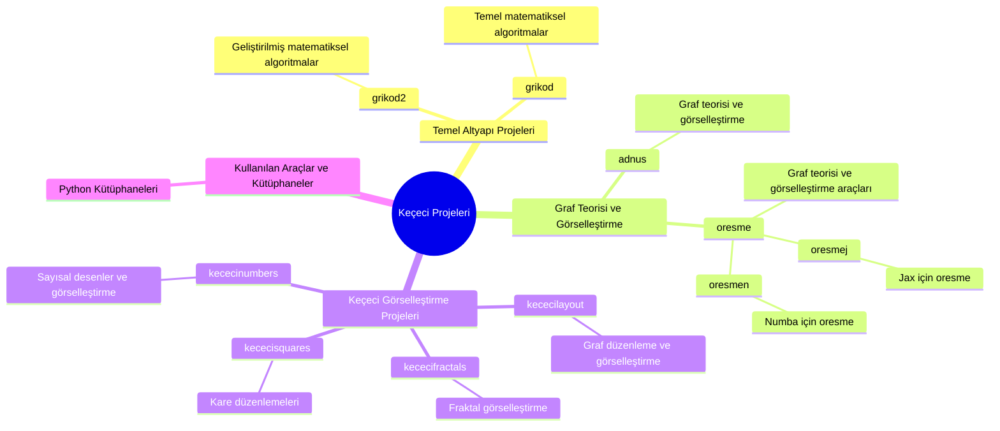

 

 

 

---
  <a
    id="cy-effective-orcid-url"
    class="underline"
     href="https://orcid.org/0000-0001-9937-9839"
     target="orcid.widget"
     rel="me noopener noreferrer"
     style="vertical-align: top">
     
      https://orcid.org/0000-0001-9937-9839
    </a>
---

---

Physicist (Completed the dissertation phase of the Ph.D. in Physics), Reviewer, Author, Teacher & Lecturer, Occupational Safety Specialist

Reviewer (~30 International Scientific Journal, 2012 - ***, > 200 English, Turkish articles)

---

# International & National Papers, Scientific Symposium, Announcements, Conference Proceedings, etc.:

Keçeci, M. (2026). Keçeci Eğrisi: Dairesel Temelli Parametrik Bir Uzay Doldurma Eğrisi Âilesi. Open Science Articles (OSAs), Zenodo. https://doi.org/10.5281/zenodo.19796065

Keçeci, M. (2026). Space-Filling Curves for Quantum Computing: From Molecular Simulations to Error Correction. Open Science Articles (OSAs), Zenodo. https://doi.org/10.5281/zenodo.19793852

Keçeci, M. (2026). kececicurve. Open Science Articles (OSAs), Zenodo. https://doi.org/10.5281/zenodo.19696338

Keçeci, M. (2026). spacecurves (0.1.3). Open Science Articles (OSAs), Zenodo. https://doi.org/10.5281/zenodo.19672791

Keçeci, M. (2026). Kuantum Hesaplamada Uzay Dolduran Eğriler: Moleküler Simülasyonlardan Hata Düzeltmeye. Open Science Articles (OSAs), Zenodo.	https://doi.org/10.5281/zenodo.19666944

Keçeci, M. (2026). Hilbert Uzayları Üzerinden Kuantum Mekaniğini Anlamak: Kuantum Hesaplamada Uygulamalar. Open Science Articles (OSAs), Zenodo.	 https://doi.org/10.5281/zenodo.19221265

Keçeci, M. (2026). Majorana Fermiyonlarından Kuantum Cihazlarına: 2. Kuantum Çağında Nanomalzemeler. Mendeley Data, https://doi.org/10.17632/7zn25dktdh 

Keçeci, M. (2026). Nodal-Line Yarımetalleri: Kuantum Bilişiminde Geometrik Bir Avantaj. Open Pub Articles (OPAs). https://doi.org/10.21428/aaf7bfa8.7cda9748, https://opas.pubpub.org/pub/lqhxrioo

Keçeci, M. (2026). Majorana Fermiyonlarından Kuantum Cihazlarına: İkinci Kuantum Çağında Nanomalzemelerin Rolü. Open Pub Articles (OPAs). https://doi.org/10.21428/aaf7bfa8.215373ff, https://opas.pubpub.org/pub/odgdo83p

Keçeci, M. (2026). Tenth-Century Scholar Imam Ismail al-Jawhari: The Second Founder of Aerodynamics. Open Science Articles (OSAs), Zenodo. https://doi.org/10.5281/zenodo.18418431

Keçeci, M. (2001). The Keçeci-Fujii Model Derived from Akdeniz-Dane Model: 2n-Dimensional Instanton Solutions, Higher-Derivative Interactions and Quantum Information Applications. Open Science Articles (OSAs), Zenodo. https://doi.org/10.5281/zenodo.18399634

Keçeci, M. (2001). Akdeniz-Dane Modelinden Keçeci-Fujii Modeline: 2n-Boyutlu Instanton Çözümleri, Yüksek Türevli \\ Etkileşimler ve Kuantum Bilgi Uygulamaları. Open Science Articles (OSAs), Zenodo. https://doi.org/10.5281/zenodo.18399540

Keçeci, M. (2026). 2n-Boyutlu Fujii Modelinde Instanton Benzeri Çözümler ve Yüksek Türevli Instantonlar Arasındaki Kuplaj Sabitinin Rolü. Open Science Articles (OSAs), Zenodo. https://doi.org/10.5281/zenodo.18398161

Keçeci, M. (2026). Onuncu Yüzyıl Âlimi İmâm İsmâil el-Cevherî: Aerodinamik Biliminin İkinci Kurucusu. Open Science Articles (OSAs), Zenodo. https://doi.org/10.5281/zenodo.18217812

Keçeci, M. (2025). KHA-256: A Next-Generation Cryptographic Hash Function Based on Keçeci Numbers and Mathematical Constants. Open Science Articles (OSAs), Zenodo. https://doi.org/10.5281/zenodo.18156885

Keçeci, M. (2025). KHA-256. GitHub, PyPI, Anaconda, Zenodo. https://doi.org/10.5281/zenodo.18089401 & https://github.com/WhiteSymmetry/kha256 & https://pypi.org/project/kha256 & https://anaconda.org/bilgi/kha256 

Keçeci, M. (2025). From Chaos to Clarity: The Keçeci Layout for Order-Dependent Systems. https://doi.org/10.5281/zenodo.17665770

Keçeci, M. (2025). Kuantum Hesaplamada Doğruluk, Gürültü ve Ölçeklenebilirlik: NISQ Çağı ve Ötesi için Stratejiler. Open Science Articles (OSAs), Zenodo. https://doi.org/10.5281/zenodo.17342849

Keçeci, M. (2025). Weyl ve Majorana Fermiyonlarını İçeren Katmanlı Yapıların Stratum Modeli ile İncelenmesi. Open Science Articles (OSAs), Zenodo. https://doi.org/10.5281/zenodo.17295984

Keçeci, M. (2025). Accelerating Quantum Algorithm Simulations in Multi-Processor Architectures: Optimisation Techniques with Cython, Numba, and Jax. Open Science Articles (OSAs), Zenodo. https://doi.org/10.5281/zenodo.17287508

Keçeci, M. (2025). The Impact of Metric Selection and Algorithmic Optimisation on Large-Scale Surface Codes in Quantum Error Correction. Open Science Articles (OSAs), Zenodo. https://doi.org/10.5281/zenodo.17259861

Keçeci, M. (2025). Recursion Optimisation and Extreme Noise Tolerance in Quantum Error Correction Algorithms: Assessing the Potential for a Quantum Leap. Open Science Articles (OSAs), Zenodo. https://doi.org/10.5281/zenodo.17243336

Keçeci, M. (2025). Scalability and Error Management in High-Qubit-Count Quantum Computing: Surface Codes, Topological Materials, and Hybrid Algorithmic Approaches. Open Science Articles (OSAs), Zenodo. https://doi.org/10.5281/zenodo.17227501

Keçeci, M. (2025). Error Minimisation in Autonomous and Convolutional Quantum Algorithms through Artificial Intelligence Integration in the Context of the Künneth Theorem. Open Science Articles (OSAs), Zenodo. https://doi.org/10.5281/zenodo.17214806

Keçeci, M. (2025). Characterization of Keçeci Number Systems as Chaotic and Hyperchaotic Maps. Open Science Articles (OSAs), Zenodo. https://doi.org/10.5281/zenodo.16954468

Keçeci, M. (2025). Deterministic Visualization of Distribution Power Grids: Integration of Power Grid Model and Keçeci Layout. Open Science Articles (OSAs), Zenodo. https://doi.org/10.5281/zenodo.16934620

Keçeci, M. (2025). Interactive Exploration of the Hamiltonian Problem with Z3 and the Keçeci Layout. Open Fig Share Articles (OFSAs), figshare. https://doi.org/10.6084/m9.figshare.29959778 

Keçeci, M. (2025). An Interactive Tool for Graph Theory Education: Exploring the Hamiltonian Problem with Z3 and the Keçeci Layout. Open Science Output Articles (OSOAs), OSF.	 https://doi.org/10.17605/OSF.IO/HZU8Y 

Keçeci, M. (2025). The Hamiltonian Problem in Graph Theory Education: An Interactive Approach Using Z3 and the Keçeci Layout. Open Science Knowledge Articles (OSKAs), . https://doi.org/10.17613/mvq42-h4262

Keçeci, M. (2025). Solving the Hamiltonian Problem in Graph Theory Education with Z3 and the Keçeci Layout. Open Work Flow Articles (OWFAs), WorkflowHub.	 https://doi.org/10.48546/workflowhub.document.48.2

Keçeci, M. (2025). Hamiltonian Problem with Z3 and the Keçeci Layout. ResearchGate. https://doi.org/10.13140/RG.2.2.27327.78244

Keçeci, M. (2025). A Novel Tool for Graph Theory Education: Interactive Exploration of the Hamiltonian Problem with Z3 and the Keçeci Layout. Open Science Articles (OSAs), Zenodo. https://doi.org/10.5281/zenodo.16920991

Keçeci, M. (2025). Z3 ve Keçeci Layout ile Hamilton Problemi. ResearchGate.	https://doi.org/10.13140/RG.2.2.23316.97924 

Keçeci, M. (2025). Graf Teorisi Eğitiminde Yeni Bir Araç: Z3 ve Keçeci Yerleşimi ile Hamilton Probleminin İnteraktif Keşfi. Open Fig Share Articles (OFSAs), figshare. https://doi.org/10.6084/m9.figshare.29958116

Keçeci, M. (2025). Graf Teorisi Eğitiminde Yeni Bir Araç: Z3 ve Keçeci Layout ile Hamilton Probleminin İnteraktif Keşfi. Open Science Output Articles (OSOAs), OSF.	https://doi.org/10.17605/OSF.IO/E23US 

Keçeci, M. (2025). Graf Teorisi Eğitiminde Z3 ve Keçeci Layout ile Hamilton Problemi. Open Science Knowledge Articles (OSKAs), . https://doi.org/10.17613/g5r9k-ksb90

Keçeci, M. (2025). Graf Teorisi Eğitiminde Z3 ve Keçeci Dizilimi ile Hamilton Problemi. Open Work Flow Articles (OWFAs), WorkflowHub. https://doi.org/10.48546/workflowhub.document.45.2

Keçeci, M. (2025). Graf Teorisi Eğitiminde Yeni Bir Araç: Z3 ve Keçeci Dizilimi ile Hamilton Probleminin İnteraktif Keşfi. Open Science Articles (OSAs), Zenodo. https://doi.org/10.5281/zenodo.16883657

Keçeci, M. (2025). Hilbert Space Theory and Its Implementation in Quantum Computing Systems. preprints.ru. https://doi.org/10.24108/preprints-3113653

Keçeci, M. (2025). Characteristic Features of Keçeci and Oresme Number Sequences: Dynamic and Static Perspectives. HAL open science, hal-05169251. https://doi.org/10.13140/RG.2.2.24879.85922

Keçeci, M. (2025). Kuantum Algoritmalarında Veri Kodlama ve Kuantizasyon Arasındaki İlişkinin Analizi ve Keçeci Layout ile Max-Cut Problemi. Open Science Articles (OSAs), Zenodo. https://doi.org/10.5281/zenodo.16755186

Keçeci, M. (2025). Keçeci Varsayımının Kuramsal ve Karşılaştırmalı Analizi. ResearchGate. https://dx.doi.org/10.13140/RG.2.2.21825.88165

Keçeci, M. (2025). Genelleştirilmiş Keçeci Operatörleri: Collatz Yinelemesinin Nötrosofik ve Hiperreel Sayı Sistemlerinde Uzantıları. Authorea.	https://doi.org/10.22541/au.175433544.41244947/v1

Keçeci, M. (2025). From Abstract Theory to Practical Application: The Journey of Hilbert Space in Quantum Technologies. Preprints. https://doi.org/10.20944/preprints202508.0171.v2; https://doi.org/10.20944/preprints202508.0171.v1

Keçeci, M. (2025). The Unifying Role of Hilbert Space in Quantum Field Theory and Information Science. Authorea. https://doi.org/10.22541/au.175449372.28574879/v1; https://doi.org/10.22541/au.175433455.53782703/v1

Keçeci, M. (2025). Keçeci ve Collatz Karşılaştırması: Benzer Algoritmalar, Farklı Çekiciler. Open Fig Share Articles (OFSAs), figshare. https://doi.org/10.6084/m9.figshare.29815910

Keçeci, M. (2025). Keçeci Varsayımı'nın Hesaplanabilirliği: Sonlu Adımda Kararlı Yapıya Yakınsama Sorunu. Open Work Flow Articles (OWFAs), WorkflowHub. https://doi.org/10.48546/workflowhub.document.44.1; https://doi.org/10.48546/workflowhub.document.44.2

Keçeci, M. (2025). Keçeci Varsayımı ve Dinamik Sistemler: Farklı Başlangıç Koşullarında Yakınsama ve Döngüler. Open Science Output Articles (OSOAs), OSF. https://doi.org/10.17605/OSF.IO/68AFN

Keçeci, M. (2025). Keçeci Varsayımı: Periyodik Çekiciler ve Keçeci Asal Sayısı (KPN) Kavramı. Open Science Knowledge Articles (OSKAs), . https://doi.org/10.17613/g60hy-egx74

Keçeci, M. (2025). Hilbert Space: The Mathematical Engine of Quantum Information Processing. Open Science Knowledge Articles (OSKAs), . https://doi.org/10.17613/6gagh-4dw41

Keçeci, M. (2025). Hilbert Space as the Geometric Foundation of Quantum Mechanics and Computing. Science Output Articles (OSOAs), OSF. https://doi.org/10.17605/OSF.IO/ZXDBK

Keçeci, M. (2025). Keçeci Varsayımı: Collatz Genelleştirmesi Olarak Çoklu Cebirsel Sistemlerde Yinelemeli Dinamikler. Open Science Articles (OSAs), Zenodo. https://doi.org/10.5281/zenodo.16702475

Keçeci, M. (2025). The Keçeci Layout: A Deterministic Visualisation Framework for the Structural Analysis of Ordered Systems in Chemistry and Environmental Science. Open Science Articles (OSAs), Zenodo. https://doi.org/10.5281/zenodo.16696713

Keçeci, M. (2025). oresmen (0.1.0). Zenodo. https://doi.org/10.5281/zenodo.16634186

Keçeci, M. (2025). The Signature of a Sequence: Variability and Stability in Keçeci and Oresme Numbers. ScienceOpen Preprints. https://doi.org/10.14293/PR2199.001860.v1

Keçeci, M. (2025). Döngülerden Vektörleştirmeye: Harmonik Seriler için Saf Python ve JAX Performans Karşılaştırması. Authorea. https://doi.org/10.22541/au.175390609.94042878/v1

Keçeci, M. (2025). From Loops to Vectorisation: A Performance Comparison of Pure Python and JAX for Harmonic Series Calculation. Authorea. https://doi.org/10.22541/au.175390610.08488249/v1

Keçeci, M. (2025). Keçeci Sayılarının Nötrosofik Çerçevede Hipergerçek Dönüşümleri ve Uygulamaları. Authorea. https://doi.org/10.22541/au.175390599.93612305/v1

Keçeci, M. (2025). Hyperreal Transformations and Applications of Keçeci Numbers in a Neutrosophic Framework. Authorea. https://doi.org/10.22541/au.175390600.02906392/v1

Keçeci, M. (2025). Hipergerçek Analiz ve Nötrosofik Kümelere Dayalı Keçeci Sayılarının Dinamik Modellenmesi. Open Science Knowledge Articles (OSKAs), Knowledge Commons. https://doi.org/10.17613/jy9mn-2va66

Keçeci, M. (2025). Dynamic Modelling of Keçeci Numbers Based on Hyperreal Analysis and Neutrosophic Sets. Open Science Knowledge Articles (OSKAs), Knowledge Commons. https://doi.org/10.17613/n4cqw-efp22

Keçeci, M. (2025). Harmonik Seri Hesaplamalarının Modernizasyonu: Geleneksel Python ve JAX Arasında Bir Performans Kıyaslaması. Science Output Articles (OSOAs), OSF. https://doi.org/10.17605/OSF.IO/BT5A3

Keçeci, M. (2025). Modernising the Computation of Harmonic Series: A Performance Benchmark between JAX and Traditional Python. Science Output Articles (OSOAs), OSF. https://doi.org/10.17605/OSF.IO/56JDU

Keçeci, M. (2025). Hesaplamalı Matematikte Verimlilik ve Sürdürülebilirlik: Harmonik Seri İçin JAX Tabanlı Bir Yaklaşım. Open Science Knowledge Articles (OSKAs), Knowledge Commons. https://doi.org/10.17613/bfw58-cbm15 

Keçeci, M. (2025). Efficiency and Sustainability in Computational Mathematics: A JAX-Based Approach to the Harmonic Series. Open Science Knowledge Articles (OSKAs), Knowledge Commons. https://doi.org/10.17613/js67q-4wc71

Keçeci, M. (2025). Hesaplamalı Matematikte Python’un Sınırları ve JAX ile Genişletilmesi: Harmonik Sayılar Üzerine Bir Uygulama. Open Work Flow Articles (OWFAs), WorkflowHub.	 https://doi.org/10.48546/workflowhub.document.42.2

Keçeci, M. (2025). The Limits of Python in Computational Mathematics and Their Extension with JAX: An Application on Harmonic Numbers. WorkflowHub.	 https://doi.org/10.48546/workflowhub.document.43.1

Keçeci, M. (2025). Performans ve Ölçeklenebilirlik Analizi: Harmonik Seri Hesaplamalarında JAX ve Saf Python'un Karşılaştırılması. Open Fig Share Articles (OFSAs), figshare. https://doi.org/10.6084/m9.figshare.29666675

Keçeci, M. (2025). A Comparative Analysis of Performance and Scalability: Computing Harmonic Series with JAX versus Pure Python. Open Fig Share Articles (OFSAs), figshare. https://doi.org/10.6084/m9.figshare.29666684

Keçeci, M. (2025). A Comparative Study of Pure Python and JAX-Based Approaches in Computing Harmonic Series. Open Science Articles (OSAs), Zenodo. https://doi.org/10.5281/zenodo.16576092

Keçeci, M. (2025). Harmonik Serilerin Hesaplanmasında Saf Python ve JAX Tabanlı Yaklaşımların Karşılaştırılması. Open Science Articles (OSAs), Zenodo. https://doi.org/10.5281/zenodo.16536195

Keçeci, M. (2025). The Keçeci Layout: A Deterministic, Order-Preserving Visualization Algorithm for Structured Systems. Open Science Articles (OSAs), Zenodo. https://doi.org/10.5281/zenodo.16526798

Keçeci, M. (2025). Keçeci Sayılarının Nötrosofik ve Hipergerçek Uzaylarda Geometrik Analizi. Open Work Flow Articles (OWFAs), WorkflowHub. https://doi.org/10.48546/workflowhub.document.40.1

Keçeci, M. (2025). Geometric Interpretations of Keçeci Numbers within Neutrosophic and Hyperreal Number Systems. Open Work Flow Articles (OWFAs), WorkflowHub. https://doi.org/10.48546/workflowhub.document.41.1

Keçeci, M. (2025). Keçeci Sayılarının Nötrosofik Hipergerçek Uzaylarda Geometrik Temsilleri. Open Fig Share Articles (OFSAs), figshare. https://doi.org/10.6084/m9.figshare.29636750

Keçeci, M. (2025). Geometric Representations of Keçeci Numbers in Neutrosophic Hyperreal Spaces. Open Fig Share Articles (OFSAs), figshare. https://doi.org/10.6084/m9.figshare.29636849

Keçeci, M. (2025). Keçeci Sayılarının Nötrosofik Küme Teorisi ve Hipergerçek Uzaylarda İncelenmesi. Science Output Articles (OSOAs), OSF. https://doi.org/10.17605/OSF.IO/KVCB6

Keçeci, M. (2025). Investigation of Keçeci Numbers via Neutrosophic Set Theory and Hyperreal Spaces. Science Output Articles (OSOAs), OSF. https://doi.org/10.17605/OSF.IO/VMK82

Keçeci, M. (2025). Geometric Interpretations of Keçeci Numbers with Neutrosophic and Hyperreal Numbers. Zenodo. https://doi.org/10.5281/zenodo.16344232

Keçeci, M. (2025). Keçeci Sayılarının Nötrosofik ve Hipergerçek Sayılarla Geometrik Yorumlamaları. Open Science Articles (OSAs), Zenodo. https://doi.org/10.5281/zenodo.16343568

Keçeci, M. (2025). adnus [Data set]. Science Output Articles (OSOAs), OSF. https://doi.org/10.17605/OSF.IO/9C26Y

Keçeci, M. (2025). adnus [Data set]. Open Fig Share Articles (OFSAs), figshare. https://doi.org/10.6084/m9.figshare.29621336

Keçeci, M. (2025). adnus [Data set]. Open Work Flow Articles (OWFAs), WorkflowHub. https://doi.org/10.48546/workflowhub.datafile.23.1

Keçeci, M. (2025). adnus. Open Science Articles (OSAs), Zenodo. https://doi.org/10.5281/zenodo.16341919

Keçeci, M. (2025). Echoes of Constancy: Waves of Change in the Keçeci and Oresme Sequences. In SciELO Preprints. https://doi.org/10.1590/SciELOPreprints.12584

Keçeci, M. (2025). Stratum Model-Based Analysis of Topological Insulators Hosting Weyl and Majorana Fermions. Open Work Flow Articles (OWFAs), WorkflowHub. https://doi.org/10.48546/workflowhub.document.39.1

Keçeci, M. (2025). Quantum Computing Applications of Weyl-Majorana Hybrid States in Layered Systems via Stratum Model. Open Fig Share Articles (OFSAs), figshare. https://doi.org/10.6084/m9.figshare.29606039

Keçeci, M. (2025). Bridging Quantum Theory and Computation: The Role of Hilbert Spaces. Open Work Flow Articles (OWFAs), WorkflowHub. https://doi.org/10.48546/workflowhub.document.38.1; https://doi.org/10.48546/workflowhub.document.38.2; https://doi.org/10.48546/workflowhub.document.38.3

Keçeci, M. (2025). Hilbert Spaces and Quantum Information: Tools for Next-Generation Computing. Open Fig Share Articles (OFSAs), figshare. https://doi.org/10.6084/m9.figshare.29604011

Keçeci, M. (2025). Between Chaos and Order: A Behavioural Portrait of Keçeci and Oresme Numbers. preprints.ru. https://doi.org/10.24108/preprints-3113623

Keçeci, M. (2025). oresmej [Data set]. ResearchGate. https://doi.org/10.13140/RG.2.2.30518.41284

Keçeci, M. (2025). oresmej [Data set]. Open Fig Share Articles (OFSAs), figshare. https://doi.org/10.6084/m9.figshare.29554532

Keçeci, M. (2025). oresmej [Data set]. Open Work Flow Articles (OWFAs), WorkflowHub. https://doi.org/10.48546/WORKFLOWHUB.DATAFILE.19.1

Keçeci, M. (2025). oresmej. Open Science Articles (OSAs), Zenodo. https://doi.org/10.5281/zenodo.15874178

Keçeci,  M. (2025). Analysing the Dynamic and Static Structures of Keçeci and Oresme Sequences. Authorea. https://doi.org/10.22541/au.175199926.64529709/v1

Keçeci,  M. (2025). Dynamic Sequences Versus Static Sequences: Keçeci and Oresme Numbers in Focus. Preprints. https://doi.org/10.20944/preprints202507.0781.v1

Keçeci, M. (2025). Mobility and Constancy in Mathematical Sequences: A Study on Keçeci and Oresme Numbers. Science Output Articles (OSOAs), OSF. https://doi.org/10.17605/osf.io/68r4v

Keçeci, Mehmet (2025). Dynamic and Static Approaches in Mathematics: Investigating Keçeci and Oresme Sequences. Open Science Knowledge Articles (OSKAs), Knowledge Commons. https://doi.org/10.17613/gbdgx-d8y63

Keçeci, Mehmet (2025). Dynamic-Static Properties of Keçeci and Oresme Number Sequences: A Comparative Examination. Open Fig Share Articles (OFSAs), figshare. Journal contribution. https://doi.org/10.6084/m9.figshare.29504960

Keçeci, M. (2025). Variability and Stability in Number Sequences: An Analysis of Keçeci and Oresme Numbers. Open Work Flow Articles (OWFAs), WorkflowHub. https://doi.org/10.48546/workflowhub.document.37.1; https://doi.org/10.48546/workflowhub.document.37.2

Keçeci, M. (2025). Dynamic vs Static Number Sequences: The Case of Keçeci and Oresme Numbers. Open Science Articles (OSAs), Zenodo. https://doi.org/10.5281/zenodo.15833351

Keçeci, M. (2025). A Graph-Theoretic Perspective on the Keçeci Layout: Structuring Cross-Disciplinary Inquiry. Preprints. https://doi.org/10.20944/preprints202507.0589.v1

Keçeci, M. (2025). Oresme. Open Fig Share Articles (OFSAs), figshare. https://doi.org/10.6084/m9.figshare.29504708

Keçeci, M. (2025). Oresme [Data set]. Open Work Flow Articles (OWFAs), WorkflowHub. https://doi.org/10.48546/workflowhub.datafile.18.1 

Keçeci, M. (2025). Oresme (0.1.0). Open Science Articles (OSAs), Zenodo. https://doi.org/10.5281/zenodo.15833238

Keçeci, M. (2025). Exploring Weyl Semimetals: Emergence of Exotic Electrons and Topological Order. HAL open science. https://hal.science/hal-05146435; https://doi.org/10.13140/RG.2.2.35594.17606

Keçeci, M. (2025). The Rise of Weyl Semimetals: Exotic States and Topological Transitions. Authorea. https://doi.org/10.22541/au.175192231.19609379/v1

Keçeci, M. (2025). Geometric Resilience in Quantum Systems: The Case of Nodal-Line Semimetals. Authorea. Authorea. https://doi.org/10.22541/au.175192307.76278430/v1

Keçeci, M. (2025). Harnessing Geometry for Quantum Computation: Lessons from Nodal-Line Materials. Open Science Knowledge Articles (OSKAs), Knowledge Commons. https://doi.org/10.17613/w6vmd-4vb84

Keçeci, M. (2025). Quantum Information at the Edge: Topological Opportunities in Nodal-Line Materials. Open Fig Share Articles (OFSAs), figshare. https://doi.org/10.6084/m9.figshare.29484947

Keçeci, M. (2025). Nodal-Line Semimetals: Unlocking Geometric Potential in Quantum Information. Open Work Flow Articles (OWFAs), WorkflowHub. https://doi.org/10.48546/workflowhub.document.36.1

Keçeci, M. (2025). From Weyl Fermions to Topological Matter: The Physics of Weyl Semimetals. Open Science Knowledge Articles (OSKAs), Knowledge Commons. https://doi.org/10.17613/p79v7-kje79

Keçeci, M. (2025). Weyl Semimetals and Their Unique Electronic and Topological Characteristics. Open Fig Share Articles (OFSAs), figshare. https://doi.org/10.6084/m9.figshare.29483816

Keçeci, M. (2025). Weyl Semimetals: Unveiling Novel Electronic Structures and Topological Properties. Open Work Flow Articles (OWFAs), WorkflowHub. https://doi.org/10.48546/workflowhub.document.35.3

Keçeci, M. (2025). When Nodes Have an Order: The Keçeci Layout for Structured System Visualization. HAL open science. https://hal.science/hal-05143155; https://doi.org/10.13140/RG.2.2.19098.76484

Keçeci, M. (2025). The Keçeci Layout: A Cross-Disciplinary Graphical Framework for Structural Analysis of Ordered Systems. Authorea. https://doi.org/10.22541/au.175156702.26421899/v1

Keçeci, M. (2025). Beyond Traditional Diagrams: The Keçeci Layout for Structural Thinking. Open Science Knowledge Articles (OSKAs), Knowledge Commons. https://doi.org/10.17613/v4w94-ak572

Keçeci, M. (2025). The Keçeci Layout: A Structural Approach for Interdisciplinary Scientific Analysis. Open Fig Share Articles (OFSAs), figshare. Journal contribution. https://doi.org/10.6084/m9.figshare.29468135

Keçeci, M. (2025, July 3). The Keçeci Layout: A Structural Approach for Interdisciplinary Scientific Analysis. Science Output Articles (OSOAs), OSF. https://doi.org/10.17605/OSF.IO/9HTG3

Keçeci, M. (2025). Beyond Topology: Deterministic and Order-Preserving Graph Visualization with the Keçeci Layout. Open Work Flow Articles (OWFAs), WorkflowHub. https://doi.org/10.48546/workflowhub.document.34.4

Keçeci, M. (2025). The Keçeci Layout: A Structural Approach for Interdisciplinary Scientific Analysis. Open Science Articles (OSAs), Zenodo. https://doi.org/10.5281/zenodo.15792684

Keçeci, M. (2025). Technical and Theoretical Bridges Between Gravitational Wave Observations and Quantum Information Processing Systems. Authorea. July, 2025. https://doi.org/10.22541/au.175138854.46819184/v1

Keçeci, M. (2025). New Technological and Methodological Approaches in Gravitational Wave Detection and Quantum Computing Development. Open Work Flow Articles (OWFAs), WorkflowHub. https://doi.org/10.48546/workflowhub.document.33.1

Keçeci, M. (2025). Scalable Complexity in Fractal Geometry: The Keçeci Fractal Approach. Authorea. June, 2025. https://doi.org/10.22541/au.175131225.56823239/v1

Keçeci, M. (2025). Keçeci Fractals. Open Work Flow Articles (OWFAs), WorkflowHub. https://doi.org/10.48546/workflowhub.document.32.2

Keçeci, M. (2025). Keçeci Deterministic Zigzag Layout. Open Work Flow Articles (OWFAs), WorkflowHub. https://doi.org/10.48546/workflowhub.document.31.1

Keçeci, M. (2025). Keçeci Zigzag Layout Algorithm. Authorea. https://doi.org/10.22541/au.175087581.16524538/v1

Keçeci, M. (2025). Keçeci's Arithmetical Square. Authorea. https://doi.org/10.22541/au.175070836.63624913/v1

Keçeci, M. (2025). Keçeci Numbers and the Keçeci Prime Number. Authorea. https://doi.org/10.22541/au.174890181.14730464/v1

Keçeci, M. (2025). Çoklu İşlemci Mimarilerinde Kuantum Algoritma Simülasyonlarının Hızlandırılması: Cython, Numba ve Jax ile Optimizasyon Teknikleri. Open Science Articles (OSAs), Zenodo. https://doi.org/10.5281/zenodo.15580503

Keçeci, M. (2025). Kuantum Hata Düzeltmede Metrik Seçimi ve Algoritmik Optimizasyonun Büyük Ölçekli Yüzey Kodları Üzerindeki Etkileri. Open Science Articles (OSAs), Zenodo. https://doi.org/10.5281/zenodo.15572200

Keçeci, M. (2025). Kuantum Hata Düzeltme Algoritmalarında Özyineleme Optimizasyonu ve Aşırı Gürültü Toleransı: Kuantum Sıçraması Potansiyelinin Değerlendirilmesi. Open Science Articles (OSAs), Zenodo. https://doi.org/10.5281/zenodo.15570678

Keçeci, M. (2025). Yüksek Kübit Sayılı Kuantum Hesaplamada Ölçeklenebilirlik ve Hata Yönetimi: Yüzey Kodları, Topolojik Malzemeler ve Hibrit Algoritmik Yaklaşımlar. Open Science Articles (OSAs), Zenodo. https://doi.org/10.5281/zenodo.15558153

Keçeci, M. (2025). Künneth Teoremi Bağlamında Özdevinimli ve Evrişimli Kuantum Algoritmalarında Yapay Zekâ Entegrasyonu ile Hata Minimizasyonu. Open Science Articles (OSAs), Zenodo. https://doi.org/10.5281/zenodo.15540875

Keçeci, M. (2025). The Relationship Between Gravitational Wave Observations and Quantum Computing Technologies. Open Science Articles (OSAs), Zenodo. https://doi.org/10.5281/zenodo.15524251

Keçeci, M. (2025). Kütleçekimsel Dalga Gözlemleri ile Kuantum Bilgisayar Teknolojileri Arasındaki Teknolojik ve Metodolojik Bağlantılar. Open Science Articles (OSAs), Zenodo. https://doi.org/10.5281/zenodo.15519591

Keçeci, M. (2025). Accuracy, Noise, and Scalability in Quantum Computation: Strategies for the NISQ Era and Beyond. Open Science Articles (OSAs), Zenodo. https://doi.org/10.5281/zenodo.15515113

Keçeci, M. (2025). Kuantum Hata Düzeltme Kodlarının Tekâmülü ve Ölçeklenebilir Kuantum Hesaplamaya Etkileri: Güncel Yaklaşımlar ve Gelecek Perspektifleri. Open Science Articles (OSAs), Zenodo. https://doi.org/10.5281/zenodo.17328711

Keçeci, M. (2025). Quantum Error Correction Codes and Their Impact on Scalable Quantum Computation: Current Approaches and Future Perspectives. Open Science Articles (OSAs), Zenodo. https://doi.org/10.5281/zenodo.15499657

Keçeci, M. (2025). Nanoscale Quantum Computers Fundamentals, Technologies, and Future Perspectives. Open Science Articles (OSAs), Zenodo. https://doi.org/10.5281/zenodo.15493024

Keçeci, M. (2025). Investigating Layered Structures Containing Weyl and Majorana Fermions via the Stratum Model. Open Science Articles (OSAs), Zenodo. https://doi.org/10.5281/zenodo.15489074

Keçeci, M. (2025). Diversity of Keçeci Numbers and Their Application to Prešić-Type Fixed-Point Iterations: A Numerical Exploration. Open Science Articles (OSAs), Zenodo. https://doi.org/10.5281/zenodo.15481711

Keçeci, M. (2025). Kuantum geometri, topolojik fazlar ve yeni matematiksel yapılar: Disiplinlerarası bir perspektif. Open Science Articles (OSAs), Zenodo. https://doi.org/10.5281/zenodo.15474957

Keçeci, M. (2025). Understanding quantum mechanics through Hilbert spaces: Applications in quantum computing. Open Science Articles (OSAs), Zenodo. https://doi.org/10.5281/zenodo.15468754

Keçeci, M. (2025). Nodal-line semimetals: A geometric advantage in quantum information. Open Science Articles (OSAs), Zenodo. https://doi.org/10.5281/zenodo.15455271

Keçeci, M. (2025). Weyl semimetals: Discovery of exotic electronic states and topological phases. Open Science Articles (OSAs), Zenodo. https://doi.org/10.5281/zenodo.15447116

Keçeci, M. (2025). The Keçeci binomial square: A reinterpretation of the standard binomial expansion and its potential applications. Open Science Articles (OSAs), Zenodo. https://doi.org/10.5281/zenodo.15425529

Keçeci, M. (2025). kececisquares [Data set]. Open Work Flow Articles (OWFAs), WorkflowHub. https://doi.org/10.48546/workflowhub.datafile.15.1 

Keçeci, M. (2025). Kececisquares. Open Science Articles (OSAs), Zenodo. https://doi.org/10.5281/zenodo.15411670

Keçeci, M. (2025). Scalable complexity: Mathematical analysis and potential for physical applications of the Keçeci circle fractal. Open Science Articles (OSAs), Zenodo. https://doi.org/10.5281/zenodo.15392772

Keçeci, M. (2025). kececifractals [Data set]. Open Work Flow Articles (OWFAs), WorkflowHub. https://doi.org/10.48546/workflowhub.datafile.16.3

Keçeci, M. (2025). Kececifractals. Open Science Articles (OSAs), Zenodo. https://doi.org/10.5281/zenodo.15392518

Keçeci, M. (2025). Keçeci numbers and the Keçeci prime number: A potential number theoretic exploratory tool. Open Science Articles (OSAs), Zenodo. https://doi.org/10.5281/zenodo.15381697

Keçeci, M. (2025). kececinumbers [Data set]. Open Fig Share Articles (OFSAs), figshare. https://doi.org/10.6084/m9.figshare.29816414

Keçeci, M. (2025). kececinumbers [Data set]. Open Work Flow Articles (OWFAs), WorkflowHub. https://doi.org/10.48546/workflowhub.datafile.14.1; https://doi.org/10.48546/workflowhub.datafile.14.2;	 https://doi.org/10.48546/workflowhub.datafile.14.3

Keçeci, M. (2025). Kececinumbers. Open Science Articles (OSAs), Zenodo. https://doi.org/10.5281/zenodo.15377659 & https://github.com/WhiteSymmetry/kececinumbers & https://pypi.org/project/kececinumbers & https://anaconda.org/bilgi/kececinumbers

Keçeci, M. (2025). From Majorana Fermions to Quantum Devices: The Role of Nanomaterials in the Second Quantum Era. Open Science Articles (OSAs), Zenodo. https://doi.org/10.5281/zenodo.15331067

Keçeci, M. (2025). Keçeci Layout. Open Science Articles (OSAs), Zenodo. https://doi.org/10.5281/zenodo.15314328

Keçeci, M. (2025). kececilayout. Open Fig Share Articles (OFSAs), figshare. https://doi.org/10.6084/m9.figshare.29582084

Keçeci, M. (2025). kececilayout [Data set]. Open Work Flow Articles (OWFAs), WorkflowHub. https://doi.org/10.48546/workflowhub.datafile.17.2

Keçeci, M. (2025). Kececilayout. Open Science Articles (OSAs), Zenodo. https://doi.org/10.5281/zenodo.15313946 

Keçeci, M. (2025). Grikod2 [Data set]. Open Work Flow Articles (OWFAs), WorkflowHub. https://doi.org/10.48546/workflowhub.datafile.13.1

Keçeci, M. (2025). Grikod2. Open Science Articles (OSAs), Zenodo. https://doi.org/10.5281/zenodo.15352206

Keçeci, M. (2025). Grikod [Data set]. Open Work Flow Articles (OWFAs), WorkflowHub. https://doi.org/10.48546/workflowhub.datafile.12.2 

Keçeci, M. (2025). Grikod. Open Science Articles (OSAs), Zenodo. https://doi.org/10.5281/zenodo.12731345

Garrett, J., Luis, E., Peng, H.-H., Cera, T., Gobinathj, Borrow, J., Keçeci, M., Splines, Iyer, S., Liu, Y., cjw, & Gasanov, M. (2022–2023). garrettj403/SciencePlots (Versions 2.1.1, 2.1.0, 2.0.1) [Computer software]. Zenodo. https://doi.org/10.5281/zenodo.10206719 (v2.1.1); https://doi.org/10.5281/zenodo.7986336 (v2.1.0); https://doi.org/10.5281/zenodo.7394724 (v2.0.1)

Keçeci, M. (2021). The Next Stop: Future Planet Walks. In SEDS Space Arts 2021, Global Art Competition, Sri Lanka. https://doi.org/10.13140/RG.2.2.21394.12482; https://doi.org/10.6084/m9.figshare.22005449

Keçeci, M. (2020). Discourse on the second quantum revolution and nanotechnology applications in the midst of the COVID-19 pandemic of inequality. International Journal of Latest Research in Science and Technology, 9(5), 1–7. eISSN: 2278-5299. https://doi.org/10.5281/zenodo.7483395; https://doi.org/jtfr; https://www.mnkjournals.com/journal/ijlrst/Article.php?paper_id=11004

Keçeci, M. (2019). Quantum and Art. Presented at International Workshop on Quantum Frontiers of Technology, TÜBİTAK, TÜSSİDE, Gebze, Türkiye. https://doi.org/10.13140/RG.2.2.27533.90089; https://tbae.tubitak.gov.tr/en/haber/quantum-frontiers-technology

Keçeci, M. (2019). 2 Boyutlu Tek Katmanlı Yapıların Su Arıtımında Kullanımının Stratejik Önemi [Strategic Importance of Use of 2 Dimensional Monolayer Structures in Water Purification] [Conference presentation]. 23. Sıvı Hâl Sempozyumu (23rd Liquid State Symposium), Pîrî Reis University, Türkiye. https://doi.org/10.5281/zenodo.15567811; https://www.researchgate.net/publication/337812505

Keçeci, M. (2017, July 19–21). Açık Dijital Rozetlerin Eğitim ve Kariyer Planlamasında Kullanımı [Use of open digital badges in education and career planning] [Conference presentation]. ADIM Fizik Günleri VI, Balıkesir Üniversitesi (ADIM Physics Days VI, Balıkesir University), Türkiye. https://doi.org/10.5281/zenodo.15567962; https://adimfizikvi.balikesir.edu.tr; https://www.researchgate.net/publication/318658786

Keçeci, M. (2011). 2n-dimensional at Fujii model instanton-like solutions and coupling constant's role between instantons with higher derivatives. Turkish Journal of Physics, 35(2), 173–178. ISSN: 1300-0101, eISSN: 1303-6122. https://doi.org/10.3906/fiz-1012-66

Keçeci, M. (2005, September 13–16). 2n-boyutlu Fujii modelinde instanton çözümleri ve bağlantı sabitinin instantonlar arasındaki rolü. Presented at World Year of Physics 2005 Turkish Physical Society 23rd International Physics Congress, Muğla University, Türkiye. https://dx.doi.org/10.13140/RG.2.1.1441.4887

Keçeci, M. (2005, May). Konformal invaryant Fujii modelinin instanton tipi tam çözümü [Instanton-like exact solution of the conformal invariant Fujii model] [Conference presentation]. Traditional Erzurum Physics Days-II, Atatürk University, Türkiye. https://dx.doi.org/10.13140/RG.2.1.3538.6408

Keçeci, M. (2002, September 16–20). Exact instanton-like solution conformal invariant of Fujii model, construct for four-dimensional and subderivative [Conference presentation]. Presented at Working Group II, Turkish Nonlinear Science Working Group, Karaburun/Izmir, Türkiye. https://dx.doi.org/10.13140/RG.2.1.1638.0964

Keçeci, M. (2001). Konformal Spinör Alan Teorileri [Conformal Spinor Field Theories] [Master's thesis, Gebze Technical University]. YÖK National Thesis Center. https://tez.yok.gov.tr/UlusalTezMerkezi/tezSorguSonucYeni.jsp (Thesis No: 109951)

---

# Technical Report

Keçeci, M. (2026). Keçeci Fraktalları ile Dalga Saçılmasının Modellenmesi. Zenodo. https://doi.org/10.5281/zenodo.18359915

Keçeci, M. (2026). Python 3.15.0a3 ve 3.11.14 Mikrobenchmark Performans Analizi. Open Science Articles (OSAs), Zenodo. https://doi.org/10.5281/zenodo.18355457

Keçeci, M. (2026). Microbenchmark Performance Analysis: Python 3.15.0a3 vs 3.11.14. Open Science Articles (OSAs), Zenodo. https://doi.org/10.5281/zenodo.18355481

---

# Yazılım/Software

Keçeci, M. (2026). kececicurve. Open Science Articles (OSAs), Zenodo. https://doi.org/10.5281/zenodo.19696338

Keçeci, M. (2026). Ezan. Open Science Articles (OSAs), Zenodo. https://doi.org/10.5281/zenodo.18722150

Garrett, J., Luis, E., Peng, H.-H., Cera, T., Gobinathj, Borrow, J., Keçeci, M., Splines, Iyer, S., Liu, Y., cjw, & Gasanov, M. (2022–2023). garrettj403/SciencePlots (Versions 2.1.1, 2.1.0, 2.0.1) [Computer software]. Zenodo. https://doi.org/10.5281/zenodo.10206719 (v2.1.1);	 https://doi.org/10.5281/zenodo.7986336 (v2.1.0); https://doi.org/10.5281/zenodo.7394724 (v2.0.1)

Keçeci, M. (20265). Spacecurves. https://github.com/WhiteSymmetry/spacecurves

Keçeci, M. (2026). spacecurves (0.1.3). Open Science Articles (OSAs), Zenodo. https://doi.org/10.5281/zenodo.19672791

Keçeci, M. (2025). Grikod2 [Data set]. Open Work Flow Articles (OWFAs), WorkflowHub.	 https://doi.org/10.48546/workflowhub.datafile.13.1 

Keçeci, M. (2025). Grikod2. Open Science Articles (OSAs), Zenodo.	 https://doi.org/10.5281/zenodo.15352206 

Keçeci, M. (2025). Grikod [Data set]. Open Work Flow Articles (OWFAs), WorkflowHub.	 https://doi.org/10.48546/workflowhub.datafile.12.2 

Keçeci, M. (2025). Grikod. Open Science Articles (OSAs), Zenodo.	 https://doi.org/10.5281/zenodo.12731345 

https://github.com/KuantumBS/grikod

https://github.com/KuantumBS/grikod2 

https://prefix.dev/channels/bilgi/packages/grikod 

https://github.com/WhiteSymmetry/graycoder

https://github.com/WhiteSymmetry/grikodrs

Keçeci, M. (2026). GriKod: A safe Rust library implementing the standard Gray code conversion. https://github.com/WhiteSymmetry/grikodrs 

Keçeci, M. (2025). From Chaos to Clarity: The Keçeci Layout for Order-Dependent Systems. https://doi.org/10.5281/zenodo.17665770 

Keçeci, M. (2025). Deterministic Visualization of Distribution Power Grids: Integration of Power Grid Model and Keçeci Layout. Open Science Articles (OSAs), Zenodo.	 https://doi.org/10.5281/zenodo.16934620 

Keçeci, M. (2025). Graf Teorisi Eğitiminde Yeni Bir Araç: Z3 ve Keçeci Dizilimi ile Hamilton Probleminin İnteraktif Keşfi. Open Science Articles (OSAs), Zenodo.	 https://doi.org/10.5281/zenodo.16883657 

Keçeci, M. (2025). The Keçeci Layout: A Deterministic Visualisation Framework for the Structural Analysis of Ordered Systems in Chemistry and Environmental Science. Open Science Articles (OSAs), Zenodo. https://doi.org/10.5281/zenodo.16696713 

Keçeci, M. (2025). The Keçeci Layout: A Deterministic, Order-Preserving Visualization Algorithm for Structured Systems. Open Science Articles (OSAs), Zenodo. https://doi.org/10.5281/zenodo.16526798 

Keçeci, M. (2025). Keçeci Deterministic Zigzag Layout. WorkflowHub.	 https://doi.org/10.48546/workflowhub.document.31.1 

Keçeci, M. (2025). Keçeci Zigzag Layout Algorithm. Authorea.	 https://doi.org/10.22541/au.175087581.16524538/v1 

Keçeci, M. (2025). The Keçeci Layout: A Structural Approach for Interdisciplinary Scientific Analysis. Open Science Articles (OSAs), Zenodo. https://doi.org/10.5281/zenodo.15792684 

Keçeci, M. (2025). When Nodes Have an Order: The Keçeci Layout for Structured System Visualization. HAL open science. https://hal.science/hal-05143155;	 https://doi.org/10.13140/RG.2.2.19098.76484 

Keçeci, M. (2025). The Keçeci Layout: A Cross-Disciplinary Graphical Framework for Structural Analysis of Ordered Systems. Authorea. https://doi.org/10.22541/au.175156702.26421899/v1 

Keçeci, M. (2025). Beyond Traditional Diagrams: The Keçeci Layout for Structural Thinking. Knowledge Commons. https://doi.org/10.17613/v4w94-ak572 

Keçeci, M. (2025). The Keçeci Layout: A Structural Approach for Interdisciplinary Scientific Analysis. figshare. Journal contribution. https://doi.org/10.6084/m9.figshare.29468135 

Keçeci, M. (2025, July 3). The Keçeci Layout: A Structural Approach for Interdisciplinary Scientific Analysis. OSF. https://doi.org/10.17605/OSF.IO/9HTG3 

Keçeci, M. (2025). Beyond Topology: Deterministic and Order-Preserving Graph Visualization with the Keçeci Layout. WorkflowHub. https://doi.org/10.48546/workflowhub.document.34.4 

Keçeci, M. (2025). A Graph-Theoretic Perspective on the Keçeci Layout: Structuring Cross-Disciplinary Inquiry. Preprints. https://doi.org/10.20944/preprints202507.0589.v1 

Keçeci, M. (2025). Keçeci Layout. Open Science Articles (OSAs), Zenodo.	 https://doi.org/10.5281/zenodo.15314328 

Keçeci, M. (2025). kececilayout [Data set]. WorkflowHub.	 https://doi.org/10.48546/workflowhub.datafile.17.1 

Keçeci, M. (2025, May 1). Kececilayout. Open Science Articles (OSAs), Zenodo.	 https://doi.org/10.5281/zenodo.15313946 

https://github.com/WhiteSymmetry/kececilayout 

https://pypi.org/project/kececilayout

https://anaconda.org/channels/bilgi/packages/kececilayout/overview 

https://prefix.dev/channels/bilgi/packages/kececilayout

Keçeci, M.. (2021). Türkish Lira. Zenodo. https://doi.org/10.5281/zenodo.4724116

---
    
# International Papers:

164\. Keçeci, M. (2001). The Keçeci-Fujii Model Derived from Akdeniz-Dane Model: 2n-Dimensional Instanton Solutions, Higher-Derivative Interactions and Quantum Information Applications. Open Science Articles (OSAs), Zenodo. https://doi.org/10.5281/zenodo.18399634

163\. Keçeci, M. (2001). Akdeniz-Dane Modelinden Keçeci-Fujii Modeline: 2n-Boyutlu Instanton Çözümleri, Yüksek Türevli \\ Etkileşimler ve Kuantum Bilgi Uygulamaları. Open Science Articles (OSAs), Zenodo. https://doi.org/10.5281/zenodo.18399540

162\. Keçeci, M. (2026). 2n-Boyutlu Fujii Modelinde Instanton Benzeri Çözümler ve Yüksek Türevli Instantonlar Arasındaki Kuplaj Sabitinin Rolü. Open Science Articles (OSAs), Zenodo. https://doi.org/10.5281/zenodo.18398161

161\. Keçeci, M. (2026). Onuncu Yüzyıl Âlimi İmâm İsmâil el-Cevherî: Aerodinamik Biliminin İkinci Kurucusu. Open Science Articles (OSAs), Zenodo. https://doi.org/10.5281/zenodo.18217812

160\. Keçeci, M. (2025). KHA-256: A Next-Generation Cryptographic Hash Function Based on Keçeci Numbers and Mathematical Constants. Open Science Articles (OSAs), Zenodo. https://doi.org/10.5281/zenodo.18156885

159\. Keçeci, M. (2025). KHA-256. GitHub, PyPI, Anaconda, Zenodo. https://doi.org/10.5281/zenodo.18089401 & https://github.com/WhiteSymmetry/kha256 & https://pypi.org/project/kha256 & https://anaconda.org/bilgi/kha256 

158\. Keçeci, M. (2025). From Chaos to Clarity: The Keçeci Layout for Order-Dependent Systems. https://doi.org/10.5281/zenodo.17665770

157\. Keçeci, M. (2025). Kuantum Hesaplamada Doğruluk, Gürültü ve Ölçeklenebilirlik: NISQ Çağı ve Ötesi için Stratejiler. Open Science Articles (OSAs), Zenodo. https://doi.org/10.5281/zenodo.17342849

156\. Keçeci, M. (2025). Weyl ve Majorana Fermiyonlarını İçeren Katmanlı Yapıların Stratum Modeli ile İncelenmesi. Open Science Articles (OSAs), Zenodo. https://doi.org/10.5281/zenodo.17295984

155\. Keçeci, M. (2025). Accelerating Quantum Algorithm Simulations in Multi-Processor Architectures: Optimisation Techniques with Cython, Numba, and Jax. Open Science Articles (OSAs), Zenodo. https://doi.org/10.5281/zenodo.17287508

154\. Keçeci, M. (2025). The Impact of Metric Selection and Algorithmic Optimisation on Large-Scale Surface Codes in Quantum Error Correction. Open Science Articles (OSAs), Zenodo. https://doi.org/10.5281/zenodo.17259861

153\. Keçeci, M. (2025). Recursion Optimisation and Extreme Noise Tolerance in Quantum Error Correction Algorithms: Assessing the Potential for a Quantum Leap. https://doi.org/10.5281/zenodo.17243336

152\. Keçeci, M. (2025). Scalability and Error Management in High-Qubit-Count Quantum Computing: Surface Codes, Topological Materials, and Hybrid Algorithmic Approaches. https://doi.org/10.5281/zenodo.17227501

151\. Keçeci, M. (2025). Error Minimisation in Autonomous and Convolutional Quantum Algorithms through Artificial Intelligence Integration in the Context of the Künneth Theorem. https://doi.org/10.5281/zenodo.17214806

150\. Keçeci, M. (2025). Characterization of Keçeci Number Systems as Chaotic and Hyperchaotic Maps. Open Science Articles (OSAs), Zenodo. https://doi.org/10.5281/zenodo.16954468

149\. Keçeci, M. (2025). Deterministic Visualization of Distribution Power Grids: Integration of Power Grid Model and Keçeci Layout. Open Science Articles (OSAs), Zenodo. https://doi.org/10.5281/zenodo.16934620

148\. Keçeci, M. (2025). Interactive Exploration of the Hamiltonian Problem with Z3 and the Keçeci Layout. Open Fig Share Articles (OFSAs), figshare. https://doi.org/10.6084/m9.figshare.29959778 

147\. Keçeci, M. (2025). An Interactive Tool for Graph Theory Education: Exploring the Hamiltonian Problem with Z3 and the Keçeci Layout. Open Science Output Articles (OSOAs), OSF.	 https://doi.org/10.17605/OSF.IO/HZU8Y 

146\. Keçeci, M. (2025). The Hamiltonian Problem in Graph Theory Education: An Interactive Approach Using Z3 and the Keçeci Layout. Open Science Knowledge Articles (OSKAs), Knowledge Commons. https://doi.org/10.17613/mvq42-h4262

145\. Keçeci, M. (2025). Solving the Hamiltonian Problem in Graph Theory Education with Z3 and the Keçeci Layout. Open Work Flow Articles (OWFAs), WorkflowHub.	 https://doi.org/10.48546/workflowhub.document.48.2

144\. Keçeci, M. (2025). Hamiltonian Problem with Z3 and the Keçeci Layout. ResearchGate. https://doi.org/10.13140/RG.2.2.27327.78244

143\. Keçeci, M. (2025). A Novel Tool for Graph Theory Education: Interactive Exploration of the Hamiltonian Problem with Z3 and the Keçeci Layout. Open Science Articles (OSAs), Zenodo. https://doi.org/10.5281/zenodo.16920991

142\. Keçeci, M. (2025). Z3 ve Keçeci Layout ile Hamilton Problemi. ResearchGate.	https://doi.org/10.13140/RG.2.2.23316.97924 

141\. Keçeci, M. (2025). Graf Teorisi Eğitiminde Yeni Bir Araç: Z3 ve Keçeci Yerleşimi ile Hamilton Probleminin İnteraktif Keşfi. Open Fig Share Articles (OFSAs), figshare. https://doi.org/10.6084/m9.figshare.29958116

140\. Keçeci, M. (2025). Graf Teorisi Eğitiminde Yeni Bir Araç: Z3 ve Keçeci Layout ile Hamilton Probleminin İnteraktif Keşfi. Open Science Output Articles (OSOAs), OSF.	https://doi.org/10.17605/OSF.IO/E23US 

139\. Keçeci, M. (2025). Graf Teorisi Eğitiminde Z3 ve Keçeci Layout ile Hamilton Problemi. Open Science Knowledge Articles (OSKAs), Knowledge Commons. https://doi.org/10.17613/g5r9k-ksb90

138\. Keçeci, M. (2025). Graf Teorisi Eğitiminde Z3 ve Keçeci Dizilimi ile Hamilton Problemi. Open Work Flow Articles (OWFAs), WorkflowHub. https://doi.org/10.48546/workflowhub.document.45.2

137\. Keçeci, M. (2025). Graf Teorisi Eğitiminde Yeni Bir Araç: Z3 ve Keçeci Dizilimi ile Hamilton Probleminin İnteraktif Keşfi. Open Science Articles (OSAs), Zenodo. https://doi.org/10.5281/zenodo.16883657

136\. Keçeci, M. (2025). Hilbert Space Theory and Its Implementation in Quantum Computing Systems. preprints.ru. https://doi.org/10.24108/preprints-3113653

135\. Keçeci, M. (2025). Characteristic Features of Keçeci and Oresme Number Sequences: Dynamic and Static Perspectives. HAL open science, hal-05169251. https://doi.org/10.13140/RG.2.2.24879.85922

134\. Keçeci, M. (2025). Kuantum Algoritmalarında Veri Kodlama ve Kuantizasyon Arasındaki İlişkinin Analizi ve Keçeci Layout ile Max-Cut Problemi. Open Science Articles (OSAs), Zenodo. https://doi.org/10.5281/zenodo.16755186

133\. Keçeci, M. (2025). Keçeci Varsayımının Kuramsal ve Karşılaştırmalı Analizi. ResearchGate. https://dx.doi.org/10.13140/RG.2.2.21825.88165

132\. Keçeci, M. (2025). Genelleştirilmiş Keçeci Operatörleri: Collatz Yinelemesinin Nötrosofik ve Hiperreel Sayı Sistemlerinde Uzantıları. Authorea.	https://doi.org/10.22541/au.175433544.41244947/v1

131\. Keçeci, M. (2025). From Abstract Theory to Practical Application: The Journey of Hilbert Space in Quantum Technologies. Preprints. https://doi.org/10.20944/preprints202508.0171.v1

130\. Keçeci, M. (2025). The Unifying Role of Hilbert Space in Quantum Field Theory and Information Science. Authorea. https://doi.org/10.22541/au.175433455.53782703/v1

129\. Keçeci, M. (2025). kececinumbers [Data set]. Open Fig Share Articles (OFSAs), figshare. https://doi.org/10.6084/m9.figshare.29816414

128\.	Keçeci, M. (2025). Keçeci ve Collatz Karşılaştırması: Benzer Algoritmalar, Farklı Çekiciler. Open Fig Share Articles (OFSAs), figshare. https://doi.org/10.6084/m9.figshare.29815910

127\.	Keçeci, M. (2025). Keçeci Varsayımı'nın Hesaplanabilirliği: Sonlu Adımda Kararlı Yapıya Yakınsama Sorunu. Open Work Flow Articles (OWFAs), WorkflowHub. https://doi.org/10.48546/workflowhub.document.44.1; https://doi.org/10.48546/workflowhub.document.44.2

126\.	Keçeci, M. (2025). Keçeci Varsayımı ve Dinamik Sistemler: Farklı Başlangıç Koşullarında Yakınsama ve Döngüler. Open Science Output Articles (OSOAs), OSF.	 https://doi.org/10.17605/OSF.IO/68AFN

125\.	Keçeci, M. (2025). Keçeci Varsayımı: Periyodik Çekiciler ve Keçeci Asal Sayısı (KPN) Kavramı. Open Science Knowledge Articles (OSKAs), Knowledge Commons. https://doi.org/10.17613/g60hy-egx74

124\. Keçeci, M. (2025). Hilbert Space: The Mathematical Engine of Quantum Information Processing. Open Science Knowledge Articles (OSKAs), Knowledge Commons. https://doi.org/10.17613/6gagh-4dw41

123\. Keçeci, M. (2025). Hilbert Space as the Geometric Foundation of Quantum Mechanics and Computing. Science Output Articles (OSOAs), OSF. https://doi.org/10.17605/OSF.IO/ZXDBK

122\. Keçeci, M. (2025). Keçeci Varsayımı: Collatz Genelleştirmesi Olarak Çoklu Cebirsel Sistemlerde Yinelemeli Dinamikler. Open Science Articles (OSAs), Zenodo. https://doi.org/10.5281/zenodo.16702475

121\. Keçeci, M. (2025). The Keçeci Layout: A Deterministic Visualisation Framework for the Structural Analysis of Ordered Systems in Chemistry and Environmental Science. Open Science Articles (OSAs), Zenodo. https://doi.org/10.5281/zenodo.16696713

120\. Keçeci, M. (2025). oresmen (0.1.0). Zenodo. https://doi.org/10.5281/zenodo.16634186

119\. Keçeci, M. (2025). The Signature of a Sequence: Variability and Stability in Keçeci and Oresme Numbers. ScienceOpen Preprints. https://doi.org/10.14293/PR2199.001860.v1

118\. Keçeci, M. (2025). Döngülerden Vektörleştirmeye: Harmonik Seriler için Saf Python ve JAX Performans Karşılaştırması. Authorea. https://doi.org/10.22541/au.175390609.94042878/v1

117\. Keçeci, M. (2025). From Loops to Vectorisation: A Performance Comparison of Pure Python and JAX for Harmonic Series Calculation. Authorea.	 https://doi.org/10.22541/au.175390610.08488249/v1

116\. Keçeci, M. (2025). Keçeci Sayılarının Nötrosofik Çerçevede Hipergerçek Dönüşümleri ve Uygulamaları. Authorea. https://doi.org/10.22541/au.175390599.93612305/v1

115\. Keçeci, M. (2025). Hyperreal Transformations and Applications of Keçeci Numbers in a Neutrosophic Framework. Authorea. https://doi.org/10.22541/au.175390600.02906392/v1

114\. Keçeci, M. (2025). Hipergerçek Analiz ve Nötrosofik Kümelere Dayalı Keçeci Sayılarının Dinamik Modellenmesi. Open Science Knowledge Articles (OSKAs), Knowledge Commons. https://doi.org/10.17613/jy9mn-2va66

113\. Keçeci, M. (2025). Dynamic Modelling of Keçeci Numbers Based on Hyperreal Analysis and Neutrosophic Sets. Open Science Knowledge Articles (OSKAs), Knowledge Commons. https://doi.org/10.17613/n4cqw-efp22

112\. Keçeci, M. (2025). Harmonik Seri Hesaplamalarının Modernizasyonu: Geleneksel Python ve JAX Arasında Bir Performans Kıyaslaması. Science Output Articles (OSOAs), OSF. https://doi.org/10.17605/OSF.IO/BT5A3

111\. Keçeci, M. (2025). Modernising the Computation of Harmonic Series: A Performance Benchmark between JAX and Traditional Python. Science Output Articles (OSOAs), OSF. https://doi.org/10.17605/OSF.IO/56JDU

110\. Keçeci, M. (2025). Hesaplamalı Matematikte Verimlilik ve Sürdürülebilirlik: Harmonik Seri İçin JAX Tabanlı Bir Yaklaşım. Open Science Knowledge Articles (OSKAs), Knowledge Commons. https://doi.org/10.17613/bfw58-cbm15 

109\. Keçeci, M. (2025). Efficiency and Sustainability in Computational Mathematics: A JAX-Based Approach to the Harmonic Series. Open Science Knowledge Articles (OSKAs), Knowledge Commons. https://doi.org/10.17613/js67q-4wc71

108\. Keçeci, M. (2025). Hesaplamalı Matematikte Python’un Sınırları ve JAX ile Genişletilmesi: Harmonik Sayılar Üzerine Bir Uygulama. WorkflowHub.	 https://doi.org/10.48546/workflowhub.document.42.2

107\. Keçeci, M. (2025). The Limits of Python in Computational Mathematics and Their Extension with JAX: An Application on Harmonic Numbers. WorkflowHub.	 https://doi.org/10.48546/workflowhub.document.43.1

106\. Keçeci, M. (2025). Performans ve Ölçeklenebilirlik Analizi: Harmonik Seri Hesaplamalarında JAX ve Saf Python'un Karşılaştırılması. Open Fig Share Articles (OFSAs), figshare. https://doi.org/10.6084/m9.figshare.29666675

105\. Keçeci, M. (2025). A Comparative Analysis of Performance and Scalability: Computing Harmonic Series with JAX versus Pure Python. Open Fig Share Articles (OFSAs), figshare. https://doi.org/10.6084/m9.figshare.29666684

104. Keçeci, M. (2025). A Comparative Study of Pure Python and JAX-Based Approaches in Computing Harmonic Series. Open Science Articles (OSAs), Zenodo. https://doi.org/10.5281/zenodo.16576092

103\.	Keçeci, M. (2025). Harmonik Serilerin Hesaplanmasında Saf Python ve JAX Tabanlı Yaklaşımların Karşılaştırılması. Open Science Articles (OSAs), Zenodo. https://doi.org/10.5281/zenodo.16536195

102\. Keçeci, M. (2025). The Keçeci Layout: A Deterministic, Order-Preserving Visualization Algorithm for Structured Systems. Open Science Articles (OSAs), Zenodo. https://doi.org/10.5281/zenodo.16526798

101\. Keçeci, M. (2025). Keçeci Sayılarının Nötrosofik ve Hipergerçek Uzaylarda Geometrik Analizi. Open Work Flow Articles (OWFAs), WorkflowHub. https://doi.org/10.48546/workflowhub.document.40.1

100\. Keçeci, M. (2025). Geometric Interpretations of Keçeci Numbers within Neutrosophic and Hyperreal Number Systems. Open Work Flow Articles (OWFAs), WorkflowHub. https://doi.org/10.48546/workflowhub.document.41.1

99\. Keçeci, M. (2025). Keçeci Sayılarının Nötrosofik Hipergerçek Uzaylarda Geometrik Temsilleri. Open Fig Share Articles (OFSAs), figshare. https://doi.org/10.6084/m9.figshare.29636750

98\. Keçeci, M. (2025). Geometric Representations of Keçeci Numbers in Neutrosophic Hyperreal Spaces. Open Fig Share Articles (OFSAs), figshare. https://doi.org/10.6084/m9.figshare.29636849

97\. Keçeci, M. (2025). Keçeci Sayılarının Nötrosofik Küme Teorisi ve Hipergerçek Uzaylarda İncelenmesi. Science Output Articles (OSOAs), OSF. https://doi.org/10.17605/OSF.IO/KVCB6

96\. Keçeci, M. (2025). Investigation of Keçeci Numbers via Neutrosophic Set Theory and Hyperreal Spaces. Science Output Articles (OSOAs), OSF. https://doi.org/10.17605/OSF.IO/VMK82

95\. Keçeci, M. (2025). Geometric Interpretations of Keçeci Numbers with Neutrosophic and Hyperreal Numbers. Zenodo. https://doi.org/10.5281/zenodo.16344232

94\. Keçeci, M. (2025). Keçeci Sayılarının Nötrosofik ve Hipergerçek Sayılarla Geometrik Yorumlamaları. Open Science Articles (OSAs), Zenodo. https://doi.org/10.5281/zenodo.16343568

93\. Keçeci, M. (2025). adnus [Data set]. Science Output Articles (OSOAs), OSF. https://doi.org/10.17605/OSF.IO/9C26Y

92\. Keçeci, M. (2025). adnus [Data set]. Open Fig Share Articles (OFSAs), figshare. https://doi.org/10.6084/m9.figshare.29621336

91\. Keçeci, M. (2025). adnus [Data set]. Open Work Flow Articles (OWFAs), WorkflowHub. https://doi.org/10.48546/workflowhub.datafile.23.1

90\. Keçeci, M. (2025). adnus. Open Science Articles (OSAs), Zenodo. https://doi.org/10.5281/zenodo.16341919

89\. Keçeci, M. (2025). Echoes of Constancy: Waves of Change in the Keçeci and Oresme Sequences. In SciELO Preprints. https://doi.org/10.1590/SciELOPreprints.12584

88\. Keçeci, M. (2025). Stratum Model-Based Analysis of Topological Insulators Hosting Weyl and Majorana Fermions. Open Work Flow Articles (OWFAs), WorkflowHub. https://doi.org/10.48546/workflowhub.document.39.1

87\. Keçeci, M. (2025). Quantum Computing Applications of Weyl-Majorana Hybrid States in Layered Systems via Stratum Model. Open Fig Share Articles (OFSAs), figshare. https://doi.org/10.6084/m9.figshare.29606039

86\. Keçeci, M. (2025). Bridging Quantum Theory and Computation: The Role of Hilbert Spaces. Open Work Flow Articles (OWFAs), WorkflowHub. https://doi.org/10.48546/workflowhub.document.38.1

85\. Keçeci, M. (2025). Hilbert Spaces and Quantum Information: Tools for Next-Generation Computing. Open Fig Share Articles (OFSAs), figshare. https://doi.org/10.6084/m9.figshare.29604011

84\. Keçeci, M. (2025). kececilayout. Open Fig Share Articles (OFSAs), figshare. https://doi.org/10.6084/m9.figshare.29582084

83\. Keçeci, M. (2025). Between Chaos and Order: A Behavioural Portrait of Keçeci and Oresme Numbers. preprints.ru. https://doi.org/10.24108/preprints-3113623

82\. Keçeci, M. (2025). oresmej [Data set]. ResearchGate. https://doi.org/10.13140/RG.2.2.30518.41284

81\. Keçeci, M. (2025). oresmej [Data set]. Open Fig Share Articles (OFSAs), figshare. https://doi.org/10.6084/m9.figshare.29554532

80\. Keçeci, M. (2025). oresmej [Data set]. Open Work Flow Articles (OWFAs), WorkflowHub. https://doi.org/10.48546/WORKFLOWHUB.DATAFILE.19.1

79\. Keçeci, M. (2025). oresmej. Open Science Articles (OSAs), Zenodo. https://doi.org/10.5281/zenodo.15874178

78\. Keçeci,  M. (2025). Analysing the Dynamic and Static Structures of Keçeci and Oresme Sequences. Authorea. https://doi.org/10.22541/au.175199926.64529709/v1

77\. Keçeci,  M. (2025). Dynamic Sequences Versus Static Sequences: Keçeci and Oresme Numbers in Focus. Preprints. https://doi.org/10.20944/preprints202507.0781.v1

76\. Keçeci, M. (2025). Mobility and Constancy in Mathematical Sequences: A Study on Keçeci and Oresme Numbers. Science Output Articles (OSOAs), OSF. https://doi.org/10.17605/osf.io/68r4v

75\. Keçeci, Mehmet (2025). Dynamic and Static Approaches in Mathematics: Investigating Keçeci and Oresme Sequences. Open Science Knowledge Articles (OSKAs), Knowledge Commons. https://doi.org/10.17613/gbdgx-d8y63

74\. Keçeci, Mehmet (2025). Dynamic-Static Properties of Keçeci and Oresme Number Sequences: A Comparative Examination. Open Fig Share Articles (OFSAs), figshare. Journal contribution. https://doi.org/10.6084/m9.figshare.29504960

73\. Keçeci, M. (2025). Variability and Stability in Number Sequences: An Analysis of Keçeci and Oresme Numbers. Open Work Flow Articles (OWFAs), WorkflowHub. https://doi.org/10.48546/workflowhub.document.37.1; https://doi.org/10.48546/workflowhub.document.37.2

72\. Keçeci, M. (2025). Dynamic vs Static Number Sequences: The Case of Keçeci and Oresme Numbers. Open Science Articles (OSAs), Zenodo. https://doi.org/10.5281/zenodo.15833351

71\. Keçeci, M. (2025). A Graph-Theoretic Perspective on the Keçeci Layout: Structuring Cross-Disciplinary Inquiry. Preprints. https://doi.org/10.20944/preprints202507.0589.v1

70\. Keçeci, M. (2025). Oresme. Open Fig Share Articles (OFSAs), figshare. https://doi.org/10.6084/m9.figshare.29504708

69\. Keçeci, M. (2025). Oresme [Data set]. Open Work Flow Articles (OWFAs), WorkflowHub. https://doi.org/10.48546/workflowhub.datafile.18.1 

68\. Keçeci, M. (2025). Oresme (0.1.0). Open Science Articles (OSAs), Zenodo. https://doi.org/10.5281/zenodo.15833238

67\. Keçeci, M. (2025). Exploring Weyl Semimetals: Emergence of Exotic Electrons and Topological Order. HAL open science. https://hal.science/hal-05146435; https://doi.org/10.13140/RG.2.2.35594.17606

67\. Keçeci, M. (2025). The Rise of Weyl Semimetals: Exotic States and Topological Transitions. Authorea. https://doi.org/10.22541/au.175192231.19609379/v1

66\. Keçeci, M. (2025). Geometric Resilience in Quantum Systems: The Case of Nodal-Line Semimetals. Authorea. Authorea. https://doi.org/10.22541/au.175192307.76278430/v1

65\. Keçeci, M. (2025). Harnessing Geometry for Quantum Computation: Lessons from Nodal-Line Materials. Open Science Knowledge Articles (OSKAs), Knowledge Commons. https://doi.org/10.17613/w6vmd-4vb84

64\. Keçeci, M. (2025). Quantum Information at the Edge: Topological Opportunities in Nodal-Line Materials. Open Fig Share Articles (OFSAs), figshare. https://doi.org/10.6084/m9.figshare.29484947

63\. Keçeci, M. (2025). Nodal-Line Semimetals: Unlocking Geometric Potential in Quantum Information. Open Work Flow Articles (OWFAs), WorkflowHub. https://doi.org/10.48546/workflowhub.document.36.1

62\. Keçeci, M. (2025). From Weyl Fermions to Topological Matter: The Physics of Weyl Semimetals. Open Science Knowledge Articles (OSKAs), Knowledge Commons. https://doi.org/10.17613/p79v7-kje79

61\. Keçeci, M. (2025). Weyl Semimetals and Their Unique Electronic and Topological Characteristics. Open Fig Share Articles (OFSAs), figshare. https://doi.org/10.6084/m9.figshare.29483816

60\. Keçeci, M. (2025). Weyl Semimetals: Unveiling Novel Electronic Structures and Topological Properties. Open Work Flow Articles (OWFAs), WorkflowHub. https://doi.org/10.48546/workflowhub.document.35.3

59\. Keçeci, M. (2025). When Nodes Have an Order: The Keçeci Layout for Structured System Visualization. HAL open science. https://hal.science/hal-05143155; https://doi.org/10.13140/RG.2.2.19098.76484

58\. Keçeci, M. (2025). The Keçeci Layout: A Cross-Disciplinary Graphical Framework for Structural Analysis of Ordered Systems. Authorea. https://doi.org/10.22541/au.175156702.26421899/v1

57\. Keçeci, M. (2025). Beyond Traditional Diagrams: The Keçeci Layout for Structural Thinking. Open Science Knowledge Articles (OSKAs), Knowledge Commons. https://doi.org/10.17613/v4w94-ak572

56\. Keçeci, M. (2025). The Keçeci Layout: A Structural Approach for Interdisciplinary Scientific Analysis. Open Fig Share Articles (OFSAs), figshare. Journal contribution. https://doi.org/10.6084/m9.figshare.29468135

55\. Keçeci, M. (2025, July 3). The Keçeci Layout: A Structural Approach for Interdisciplinary Scientific Analysis. Science Output Articles (OSOAs), OSF. https://doi.org/10.17605/OSF.IO/9HTG3

54\. Keçeci, M. (2025). Beyond Topology: Deterministic and Order-Preserving Graph Visualization with the Keçeci Layout. Open Work Flow Articles (OWFAs), WorkflowHub. https://doi.org/10.48546/workflowhub.document.34.4

53\. Keçeci, M. (2025). The Keçeci Layout: A Structural Approach for Interdisciplinary Scientific Analysis. Open Science Articles (OSAs), Zenodo. https://doi.org/10.5281/zenodo.15792684

52\.	Keçeci, M. (2025). Technical and Theoretical Bridges Between Gravitational Wave Observations and Quantum Information Processing Systems. Authorea. https://doi.org/10.22541/au.175138854.46819184/v1

51\.	Keçeci, M. (2025). New Technological and Methodological Approaches in Gravitational Wave Detection and Quantum Computing Development. Open Work Flow Articles (OWFAs), WorkflowHub. https://doi.org/10.48546/workflowhub.document.33.1

50\.	Keçeci, M. (2025). Scalable Complexity in Fractal Geometry: The Keçeci Fractal Approach. Authorea. https://doi.org/10.22541/au.175131225.56823239/v1

49\.	Keçeci, M. (2025). Keçeci Fractals. Open Work Flow Articles (OWFAs), WorkflowHub. https://doi.org/10.48546/workflowhub.document.32.2

48\.	Keçeci, M. (2025). Keçeci Deterministic Zigzag Layout. Open Work Flow Articles (OWFAs), WorkflowHub. https://doi.org/10.48546/workflowhub.document.31.1
    
47\.	Keçeci, M. (2025). Keçeci Zigzag Layout Algorithm. Authorea. June, 2025. https://doi.org/10.22541/au.175087581.16524538/v1
    
46\.	Keçeci, M. (2025). Keçeci's Arithmetical Square. Authorea. June, 2025. https://doi.org/10.22541/au.175070836.63624913/v1
    
45\.	Keçeci, M. (2025). Keçeci Numbers and the Keçeci Prime Number. Authorea. June, 2025. https://doi.org/10.22541/au.174890181.14730464/v1
    
44\.	Keçeci, M. (2025). Çoklu İşlemci Mimarilerinde Kuantum Algoritma Simülasyonlarının Hızlandırılması: Cython, Numba ve Jax ile Optimizasyon Teknikleri. Open Science Articles (OSAs), Zenodo. https://doi.org/10.5281/zenodo.15580503
    
43\.	Keçeci, M. (2025). Kuantum Hata Düzeltmede Metrik Seçimi ve Algoritmik Optimizasyonun Büyük Ölçekli Yüzey Kodları Üzerindeki Etkileri. Open Science Articles (OSAs), Zenodo. https://doi.org/10.5281/zenodo.15572200
    
42\.	Keçeci, M. (2025). Kuantum Hata Düzeltme Algoritmalarında Özyineleme Optimizasyonu ve Aşırı Gürültü Toleransı: Kuantum Sıçraması Potansiyelinin Değerlendirilmesi. Open Science Articles (OSAs), Zenodo. https://doi.org/10.5281/zenodo.15570678
    
41\.	Keçeci, M. (2025). Yüksek Kübit Sayılı Kuantum Hesaplamada Ölçeklenebilirlik ve Hata Yönetimi: Yüzey Kodları, Topolojik Malzemeler ve Hibrit Algoritmik Yaklaşımlar. Open Science Articles (OSAs), Zenodo. https://doi.org/10.5281/zenodo.15558153
    
40\.	Keçeci, M. (2025). Künneth Teoremi Bağlamında Özdevinimli ve Evrişimli Kuantum Algoritmalarında Yapay Zekâ Entegrasyonu ile Hata Minimizasyonu. Open Science Articles (OSAs), Zenodo. https://doi.org/10.5281/zenodo.15540875
    
39\.	Keçeci, M. (2025). The Relationship Between Gravitational Wave Observations and Quantum Computing Technologies. Open Science Articles (OSAs), Zenodo. https://doi.org/10.5281/zenodo.15524251
    
38\.	Keçeci, M. (2025). Kütleçekimsel Dalga Gözlemleri ile Kuantum Bilgisayar Teknolojileri Arasındaki Teknolojik ve Metodolojik Bağlantılar. Open Science Articles (OSAs), Zenodo. https://doi.org/10.5281/zenodo.15519591
    
37\.	Keçeci, M. (2025). Accuracy, Noise, and Scalability in Quantum Computation: Strategies for the NISQ Era and Beyond. Open Science Articles (OSAs), Zenodo. https://doi.org/10.5281/zenodo.15515113
    
36\.	Keçeci, M. (2025). Quantum Error Correction Codes and Their Impact on Scalable Quantum Computation: Current Approaches and Future Perspectives. Open Science Articles (OSAs), Zenodo. https://doi.org/10.5281/zenodo.15499657
    
35\.	Keçeci, M. (2025). Nanoscale Quantum Computers Fundamentals, Technologies, and Future Perspectives. Open Science Articles (OSAs), Zenodo. https://doi.org/10.5281/zenodo.15493024
    
34\.	Keçeci, M. (2025). Investigating Layered Structures Containing Weyl and Majorana Fermions via the Stratum Model. Open Science Articles (OSAs), Zenodo. https://doi.org/10.5281/zenodo.15489074
    
33\.	Keçeci, M. (2025). Diversity of Keçeci Numbers and Their Application to Prešić-Type Fixed-Point Iterations: A Numerical Exploration. Open Science Articles (OSAs), Zenodo. https://doi.org/10.5281/zenodo.15481711
    
32\.	Keçeci, M. (2025). Kuantum geometri, topolojik fazlar ve yeni matematiksel yapılar: Disiplinlerarası bir perspektif. Open Science Articles (OSAs), Zenodo. https://doi.org/10.5281/zenodo.15474957
    
31\.	Keçeci, M. (2025). Understanding quantum mechanics through Hilbert spaces: Applications in quantum computing. Open Science Articles (OSAs), Zenodo. https://doi.org/10.5281/zenodo.15468754
    
30\.	Keçeci, M. (2025). Nodal-line semimetals: A geometric advantage in quantum information. Open Science Articles (OSAs), Zenodo. https://doi.org/10.5281/zenodo.15455271
    
29\.	Keçeci, M. (2025). Weyl semimetals: Discovery of exotic electronic states and topological phases. Open Science Articles (OSAs), Zenodo. https://doi.org/10.5281/zenodo.15447116
    
28\.	Keçeci, M. (2025, May 15). The Keçeci binomial square: A reinterpretation of the standard binomial expansion and its potential applications. Open Science Articles (OSAs), Zenodo. https://doi.org/10.5281/zenodo.15425529
    
27\.	Keçeci, M. (2025). kececisquares [Data set]. Open Work Flow Articles (OWFAs), WorkflowHub. https://doi.org/10.48546/workflowhub.datafile.15.1
    
26\.	Keçeci, M. (2025, May 14). Kececisquares. Open Science Articles (OSAs), Zenodo. https://doi.org/10.5281/zenodo.15411670
    
25\.	Keçeci, M. (2025, May 13). Scalable complexity: Mathematical analysis and potential for physical applications of the Keçeci circle fractal. Open Science Articles (OSAs), Zenodo. https://doi.org/10.5281/zenodo.15392772
    
24\.	Keçeci, M. (2025). kececifractals [Data set]. Open Work Flow Articles (OWFAs), WorkflowHub. https://doi.org/10.48546/workflowhub.datafile.16.3
    
23\.	Keçeci, M. (2025, May 13). Kececifractals. Open Science Articles (OSAs), Zenodo. https://doi.org/10.5281/zenodo.15392518
    
22\.	Keçeci, M. (2025, May 11). Keçeci numbers and the Keçeci prime number: A potential number theoretic exploratory tool. Open Science Articles (OSAs), Zenodo. https://doi.org/10.5281/zenodo.15381697

21\. Keçeci, M. (2025). kececinumbers [Data set]. Open Work Flow Articles (OWFAs), WorkflowHub. https://doi.org/10.48546/workflowhub.datafile.14.1; https://doi.org/10.48546/workflowhub.datafile.14.2;	 https://doi.org/10.48546/workflowhub.datafile.14.3
    
20\.	Keçeci, M. (2025, May 10). Kececinumbers. Open Science Articles (OSAs), Zenodo. https://doi.org/10.5281/zenodo.15377659
    
19\.	Keçeci, M. (2025). From Majorana Fermions to Quantum Devices: The Role of Nanomaterials in the Second Quantum Era. Open Science Articles (OSAs), Zenodo. https://doi.org/10.5281/zenodo.15331067
    
18\.	Keçeci, M. (2025, May 1). Keçeci Layout. Open Science Articles (OSAs), Zenodo. https://doi.org/10.5281/zenodo.15314328
    
17\.	Keçeci, M. (2025). kececilayout [Data set]. Open Work Flow Articles (OWFAs), WorkflowHub. https://doi.org/10.48546/workflowhub.datafile.17.1
    
16\.	Keçeci, M. (2025, May 1). Kececilayout. Open Science Articles (OSAs), Zenodo. https://doi.org/10.5281/zenodo.15313946
    
15\.	Keçeci, M. (2025). Grikod2 [Data set]. Open Work Flow Articles (OWFAs), WorkflowHub. https://doi.org/10.48546/workflowhub.datafile.13.1
    
14\.	Keçeci, M. (2025, May 6). Grikod2. Open Science Articles (OSAs), Zenodo. https://doi.org/10.5281/zenodo.15352206
    
13\.	Keçeci, M. (2025). Grikod [Data set]. Open Work Flow Articles (OWFAs), WorkflowHub. https://doi.org/10.48546/workflowhub.datafile.12.2
    
12\.	Keçeci, M. (2025, May 6). Grikod. Open Science Articles (OSAs), Zenodo. https://doi.org/10.5281/zenodo.12731345
    
11\.	Garrett, J., Luis, E., Peng, H.-H., Cera, T., Gobinathj, Borrow, J., Keçeci, M., Splines, Iyer, S., Liu, Y., cjw, & Gasanov, M. (2022–2023). garrettj403/SciencePlots (Versions 2.1.1, 2.1.0, 2.0.1) [Computer software]. Zenodo. https://doi.org/10.5281/zenodo.10206719 (v2.1.1); https://doi.org/10.5281/zenodo.7986336 (v2.1.0); https://doi.org/10.5281/zenodo.7394724 (v2.0.1)
    
10\.	Keçeci, M. (2021). The Next Stop: Future Planet Walks. In SEDS Space Arts 2021, Global Art Competition, Sri Lanka. https://doi.org/10.13140/RG.2.2.21394.12482; https://doi.org/10.6084/m9.figshare.22005449
    
9\.	Keçeci, M. (2020, October 25). Discourse on the second quantum revolution and nanotechnology applications in the midst of the COVID-19 pandemic of inequality. International Journal of Latest Research in Science and Technology, 9(5), 1–7. eISSN: 2278-5299. https://doi.org/10.5281/zenodo.7483395; https://doi.org/jtfr; https://www.mnkjournals.com/journal/ijlrst/Article.php?paper_id=11004
    
8\.	Keçeci, M. (2019). Quantum and Art. Presented at International Workshop on Quantum Frontiers of Technology, TÜBİTAK, TÜSSİDE, Gebze, Türkiye. https://doi.org/10.13140/RG.2.2.27533.90089; https://tbae.tubitak.gov.tr/en/haber/quantum-frontiers-technology
   
7\.	Keçeci, M. (2019, December 6). 2 Boyutlu Tek Katmanlı Yapıların Su Arıtımında Kullanımının Stratejik Önemi [Strategic Importance of Use of 2 Dimensional Monolayer Structures in Water Purification] [Conference presentation]. 23. Sıvı Hâl Sempozyumu (23rd Liquid State Symposium), Pîrî Reis University, Türkiye. https://doi.org/10.5281/zenodo.15567811; https://www.researchgate.net/publication/337812505

6\.	Keçeci, M. (2017, July 19–21). Açık Dijital Rozetlerin Eğitim ve Kariyer Planlamasında Kullanımı [Use of open digital badges in education and career planning] [Conference presentation]. ADIM Fizik Günleri VI, Balıkesir Üniversitesi (ADIM Physics Days VI, Balıkesir University), Türkiye. https://doi.org/10.5281/zenodo.15567962; https://adimfizikvi.balikesir.edu.tr; https://www.researchgate.net/publication/318658786

5\.	Keçeci, M. (2011). 2n-dimensional at Fujii model instanton-like solutions and coupling constant's role between instantons with higher derivatives. Turkish Journal of Physics, 35(2), 173–178. ISSN: 1300-0101, eISSN: 1303-6122. https://doi.org/10.3906/fiz-1012-66

4\.	Keçeci, M. (2005, September 13–16). 2n-boyutlu Fujii modelinde instanton çözümleri ve bağlantı sabitinin instantonlar arasındaki rolü. Presented at World Year of Physics 2005 Turkish Physical Society 23rd International Physics Congress, Muğla University, Türkiye. https://dx.doi.org/10.13140/RG.2.1.1441.4887

3\.	Keçeci, M. (2005, May). Konformal invaryant Fujii modelinin instanton tipi tam çözümü [Instanton-like exact solution of the conformal invariant Fujii model] [Conference presentation]. Traditional Erzurum Physics Days-II, Atatürk University, Türkiye. https://dx.doi.org/10.13140/RG.2.1.3538.6408

2\.	Keçeci, M. (2002, September 16–20). Exact instanton-like solution conformal invariant of Fujii model, construct for four-dimensional and subderivative [Conference presentation]. Presented at Working Group II, Turkish Nonlinear Science Working Group, Karaburun/Izmir, Türkiye. https://dx.doi.org/10.13140/RG.2.1.1638.0964

1\.	Keçeci, M. (2001). Konformal Spinör Alan Teorileri [Conformal Spinor Field Theories] [Master's thesis, Gebze Technical University]. YÖK National Thesis Center. https://tez.yok.gov.tr/UlusalTezMerkezi/tezSorguSonucYeni.jsp (Thesis No: 109951)
   
---
# International Papers:

1. Keçeci, M. (2001). The Keçeci-Fujii Model Derived from Akdeniz-Dane Model: 2n-Dimensional Instanton Solutions, Higher-Derivative Interactions and Quantum Information Applications. Open Science Articles (OSAs), Zenodo. https://doi.org/10.5281/zenodo.18399634

1. Keçeci, M. (2001). Akdeniz-Dane Modelinden Keçeci-Fujii Modeline: 2n-Boyutlu Instanton Çözümleri, Yüksek Türevli \\ Etkileşimler ve Kuantum Bilgi Uygulamaları. Open Science Articles (OSAs), Zenodo. https://doi.org/10.5281/zenodo.18399540

1. Keçeci, M. (2026). 2n-Boyutlu Fujii Modelinde Instanton Benzeri Çözümler ve Yüksek Türevli Instantonlar Arasındaki Kuplaj Sabitinin Rolü. Open Science Articles (OSAs), Zenodo. https://doi.org/10.5281/zenodo.18398161

1. Keçeci, M. (2026). Onuncu Yüzyıl Âlimi İmâm İsmâil el-Cevherî: Aerodinamik Biliminin İkinci Kurucusu. Open Science Articles (OSAs), Zenodo. https://doi.org/10.5281/zenodo.18217812

1. Keçeci, M. (2025). KHA-256: A Next-Generation Cryptographic Hash Function Based on Keçeci Numbers and Mathematical Constants. Open Science Articles (OSAs), Zenodo. https://doi.org/10.5281/zenodo.18156885

1. Keçeci, M. (2025). KHA-256: A Next-Generation Cryptographic Hash Function Based on Keçeci Numbers and Mathematical Constants. Open Science Articles (OSAs), Zenodo. https://doi.org/10.5281/zenodo.18156885

1. Keçeci, M. (2025). KHA-256. GitHub, PyPI, Anaconda, Zenodo. https://doi.org/10.5281/zenodo.18089401 & https://github.com/WhiteSymmetry/kha256 & https://pypi.org/project/kha256 & https://anaconda.org/bilgi/kha256 

1. Keçeci, M. (2025). From Chaos to Clarity: The Keçeci Layout for Order-Dependent Systems. https://doi.org/10.5281/zenodo.17665770

1. Keçeci, M. (2025). Kuantum Hesaplamada Doğruluk, Gürültü ve Ölçeklenebilirlik: NISQ Çağı ve Ötesi için Stratejiler. Open Science Articles (OSAs), Zenodo. https://doi.org/10.5281/zenodo.17342849

1. Keçeci, M. (2025). Weyl ve Majorana Fermiyonlarını İçeren Katmanlı Yapıların Stratum Modeli ile İncelenmesi. Open Science Articles (OSAs), Zenodo. https://doi.org/10.5281/zenodo.17295984

1. Keçeci, M. (2025). Accelerating Quantum Algorithm Simulations in Multi-Processor Architectures: Optimisation Techniques with Cython, Numba, and Jax. Open Science Articles (OSAs), Zenodo. https://doi.org/10.5281/zenodo.17287508

1. Keçeci, M. (2025). The Impact of Metric Selection and Algorithmic Optimisation on Large-Scale Surface Codes in Quantum Error Correction. Open Science Articles (OSAs), Zenodo. https://doi.org/10.5281/zenodo.17259861

1. Keçeci, M. (2025). Recursion Optimisation and Extreme Noise Tolerance in Quantum Error Correction Algorithms: Assessing the Potential for a Quantum Leap. https://doi.org/10.5281/zenodo.17243336

1. Keçeci, M. (2025). Scalability and Error Management in High-Qubit-Count Quantum Computing: Surface Codes, Topological Materials, and Hybrid Algorithmic Approaches. https://doi.org/10.5281/zenodo.17227501

1. Keçeci, M. (2025). Error Minimisation in Autonomous and Convolutional Quantum Algorithms through Artificial Intelligence Integration in the Context of the Künneth Theorem. https://doi.org/10.5281/zenodo.17214806

1. Keçeci, M. (2025). Characterization of Keçeci Number Systems as Chaotic and Hyperchaotic Maps. Open Science Articles (OSAs), Zenodo. https://doi.org/10.5281/zenodo.16954468

1. Keçeci, M. (2025). Deterministic Visualization of Distribution Power Grids: Integration of Power Grid Model and Keçeci Layout. Open Science Articles (OSAs), Zenodo. https://doi.org/10.5281/zenodo.16934620

1. Keçeci, M. (2025). Interactive Exploration of the Hamiltonian Problem with Z3 and the Keçeci Layout. Open Fig Share Articles (OFSAs), figshare. https://doi.org/10.6084/m9.figshare.29959778 

1.	Keçeci, M. (2025). An Interactive Tool for Graph Theory Education: Exploring the Hamiltonian Problem with Z3 and the Keçeci Layout. Open Science Output Articles (OSOAs), OSF.	 https://doi.org/10.17605/OSF.IO/HZU8Y 

1.	Keçeci, M. (2025). The Hamiltonian Problem in Graph Theory Education: An Interactive Approach Using Z3 and the Keçeci Layout. Open Science Knowledge Articles (OSKAs), Knowledge Commons. https://doi.org/10.17613/mvq42-h4262

1.	Keçeci, M. (2025). Solving the Hamiltonian Problem in Graph Theory Education with Z3 and the Keçeci Layout. Open Work Flow Articles (OWFAs), WorkflowHub.	 https://doi.org/10.48546/workflowhub.document.48.2

1.	Keçeci, M. (2025). Hamiltonian Problem with Z3 and the Keçeci Layout. ResearchGate. https://doi.org/10.13140/RG.2.2.27327.78244

1.	Keçeci, M. (2025). A Novel Tool for Graph Theory Education: Interactive Exploration of the Hamiltonian Problem with Z3 and the Keçeci Layout. Open Science Articles (OSAs), Zenodo. https://doi.org/10.5281/zenodo.16920991

1.	Keçeci, M. (2025). Z3 ve Keçeci Layout ile Hamilton Problemi. ResearchGate.	https://doi.org/10.13140/RG.2.2.23316.97924 

1.	Keçeci, M. (2025). Graf Teorisi Eğitiminde Yeni Bir Araç: Z3 ve Keçeci Yerleşimi ile Hamilton Probleminin İnteraktif Keşfi. Open Fig Share Articles (OFSAs), figshare. https://doi.org/10.6084/m9.figshare.29958116

1.	Keçeci, M. (2025). Graf Teorisi Eğitiminde Yeni Bir Araç: Z3 ve Keçeci Layout ile Hamilton Probleminin İnteraktif Keşfi. Open Science Output Articles (OSOAs), OSF.	https://doi.org/10.17605/OSF.IO/E23US

1.	Keçeci, M. (2025). Graf Teorisi Eğitiminde Z3 ve Keçeci Layout ile Hamilton Problemi. Open Science Knowledge Articles (OSKAs), Knowledge Commons. https://doi.org/10.17613/g5r9k-ksb90

1.	Keçeci, M. (2025). Graf Teorisi Eğitiminde Z3 ve Keçeci Dizilimi ile Hamilton Problemi. Open Work Flow Articles (OWFAs), WorkflowHub. https://doi.org/10.48546/workflowhub.document.45.2

1. Keçeci, M. (2025). Graf Teorisi Eğitiminde Yeni Bir Araç: Z3 ve Keçeci Dizilimi ile Hamilton Probleminin İnteraktif Keşfi. Open Science Articles (OSAs), Zenodo. https://doi.org/10.5281/zenodo.16883657

1. Keçeci, M. (2025). Hilbert Space Theory and Its Implementation in Quantum Computing Systems. preprints.ru. https://doi.org/10.24108/preprints-3113653

1. Keçeci, M. (2025). Characteristic Features of Keçeci and Oresme Number Sequences: Dynamic and Static Perspectives. HAL open science, hal-05169251. https://doi.org/10.13140/RG.2.2.24879.85922

1. Keçeci, M. (2025). Kuantum Algoritmalarında Veri Kodlama ve Kuantizasyon Arasındaki İlişkinin Analizi ve Keçeci Layout ile Max-Cut Problemi. Open Science Articles (OSAs), Zenodo. https://doi.org/10.5281/zenodo.16755186

1. Keçeci, M. (2025). Keçeci Varsayımının Kuramsal ve Karşılaştırmalı Analizi. ResearchGate. https://dx.doi.org/10.13140/RG.2.2.21825.88165

1. Keçeci, M. (2025). Genelleştirilmiş Keçeci Operatörleri: Collatz Yinelemesinin Nötrosofik ve Hiperreel Sayı Sistemlerinde Uzantıları. Authorea.	https://doi.org/10.22541/au.175433544.41244947/v1

1. Keçeci, M. (2025). From Abstract Theory to Practical Application: The Journey of Hilbert Space in Quantum Technologies. Preprints. https://doi.org/10.20944/preprints202508.0171.v1

1. Keçeci, M. (2025). The Unifying Role of Hilbert Space in Quantum Field Theory and Information Science. Authorea. https://doi.org/10.22541/au.175433455.53782703/v1

1.	Keçeci, M. (2025). Keçeci ve Collatz Karşılaştırması: Benzer Algoritmalar, Farklı Çekiciler. Open Fig Share Articles (OFSAs), figshare. https://doi.org/10.6084/m9.figshare.29815910

1.	Keçeci, M. (2025). Keçeci Varsayımı'nın Hesaplanabilirliği: Sonlu Adımda Kararlı Yapıya Yakınsama Sorunu. Open Work Flow Articles (OWFAs), WorkflowHub. https://doi.org/10.48546/workflowhub.document.44.1; https://doi.org/10.48546/workflowhub.document.44.2

1.	Keçeci, M. (2025). Keçeci Varsayımı ve Dinamik Sistemler: Farklı Başlangıç Koşullarında Yakınsama ve Döngüler. Open Science Output Articles (OSOAs), OSF.	 https://doi.org/10.17605/OSF.IO/68AFN

1.	Keçeci, M. (2025). Keçeci Varsayımı: Periyodik Çekiciler ve Keçeci Asal Sayısı (KPN) Kavramı. Open Science Knowledge Articles (OSKAs), Knowledge Commons. https://doi.org/10.17613/g60hy-egx74

1. Keçeci, M. (2025). Hilbert Space: The Mathematical Engine of Quantum Information Processing. Open Science Knowledge Articles (OSKAs), Knowledge Commons. https://doi.org/10.17613/6gagh-4dw41

1. Keçeci, M. (2025). Hilbert Space as the Geometric Foundation of Quantum Mechanics and Computing. Science Output Articles (OSOAs), OSF. https://doi.org/10.17605/OSF.IO/ZXDBK

1. Keçeci, M. (2025). Keçeci Varsayımı: Collatz Genelleştirmesi Olarak Çoklu Cebirsel Sistemlerde Yinelemeli Dinamikler. Open Science Articles (OSAs), Zenodo. https://doi.org/10.5281/zenodo.16702475

1. Keçeci, M. (2025). The Keçeci Layout: A Deterministic Visualisation Framework for the Structural Analysis of Ordered Systems in Chemistry and Environmental Science. Open Science Articles (OSAs), Zenodo. https://doi.org/10.5281/zenodo.16696713

1. Keçeci, M. (2025). oresmen (0.1.0). Zenodo. https://doi.org/10.5281/zenodo.16634186

1. Keçeci, M. (2025). The Signature of a Sequence: Variability and Stability in Keçeci and Oresme Numbers. ScienceOpen Preprints. https://doi.org/10.14293/PR2199.001860.v1

1. Keçeci, M. (2025). Döngülerden Vektörleştirmeye: Harmonik Seriler için Saf Python ve JAX Performans Karşılaştırması. Authorea. https://doi.org/10.22541/au.175390609.94042878/v1

1. Keçeci, M. (2025). From Loops to Vectorisation: A Performance Comparison of Pure Python and JAX for Harmonic Series Calculation. Authorea.	 https://doi.org/10.22541/au.175390610.08488249/v1

1. Keçeci, M. (2025). Keçeci Sayılarının Nötrosofik Çerçevede Hipergerçek Dönüşümleri ve Uygulamaları. Authorea. https://doi.org/10.22541/au.175390599.93612305/v1

1. Keçeci, M. (2025). Hyperreal Transformations and Applications of Keçeci Numbers in a Neutrosophic Framework. Authorea. https://doi.org/10.22541/au.175390600.02906392/v1

1. Keçeci, M. (2025). Hipergerçek Analiz ve Nötrosofik Kümelere Dayalı Keçeci Sayılarının Dinamik Modellenmesi. Open Science Knowledge Articles (OSKAs), Knowledge Commons. https://doi.org/10.17613/jy9mn-2va66

1. Keçeci, M. (2025). Dynamic Modelling of Keçeci Numbers Based on Hyperreal Analysis and Neutrosophic Sets. Open Science Knowledge Articles (OSKAs), Knowledge Commons. https://doi.org/10.17613/n4cqw-efp22

1. Keçeci, M. (2025). Harmonik Seri Hesaplamalarının Modernizasyonu: Geleneksel Python ve JAX Arasında Bir Performans Kıyaslaması. Science Output Articles (OSOAs), OSF. https://doi.org/10.17605/OSF.IO/BT5A3

1. Keçeci, M. (2025). Modernising the Computation of Harmonic Series: A Performance Benchmark between JAX and Traditional Python. Science Output Articles (OSOAs), OSF. https://doi.org/10.17605/OSF.IO/56JDU

1. Keçeci, M. (2025). Hesaplamalı Matematikte Verimlilik ve Sürdürülebilirlik: Harmonik Seri İçin JAX Tabanlı Bir Yaklaşım. Open Science Knowledge Articles (OSKAs), Knowledge Commons. https://doi.org/10.17613/bfw58-cbm15 

1. Keçeci, M. (2025). Efficiency and Sustainability in Computational Mathematics: A JAX-Based Approach to the Harmonic Series. Open Science Knowledge Articles (OSKAs), Knowledge Commons. https://doi.org/10.17613/js67q-4wc71

1. Keçeci, M. (2025). Hesaplamalı Matematikte Python’un Sınırları ve JAX ile Genişletilmesi: Harmonik Sayılar Üzerine Bir Uygulama. WorkflowHub.	 https://doi.org/10.48546/workflowhub.document.42.2

1. Keçeci, M. (2025). The Limits of Python in Computational Mathematics and Their Extension with JAX: An Application on Harmonic Numbers. WorkflowHub.	 https://doi.org/10.48546/workflowhub.document.43.1

1. Keçeci, M. (2025). Performans ve Ölçeklenebilirlik Analizi: Harmonik Seri Hesaplamalarında JAX ve Saf Python'un Karşılaştırılması. Open Fig Share Articles (OFSAs), figshare. https://doi.org/10.6084/m9.figshare.29666675

1. Keçeci, M. (2025). A Comparative Analysis of Performance and Scalability: Computing Harmonic Series with JAX versus Pure Python. Open Fig Share Articles (OFSAs), figshare. https://doi.org/10.6084/m9.figshare.29666684

1. Keçeci, M. (2025). A Comparative Study of Pure Python and JAX-Based Approaches in Computing Harmonic Series. Open Science Articles (OSAs), Zenodo. https://doi.org/10.5281/zenodo.16576092

1. Keçeci, M. (2025). Harmonik Serilerin Hesaplanmasında Saf Python ve JAX Tabanlı Yaklaşımların Karşılaştırılması. Open Science Articles (OSAs), Zenodo. https://doi.org/10.5281/zenodo.16536195

1. Keçeci, M. (2025). The Keçeci Layout: A Deterministic, Order-Preserving Visualization Algorithm for Structured Systems. Open Science Articles (OSAs), Zenodo. https://doi.org/10.5281/zenodo.16526798

1. Keçeci, M. (2025). Keçeci Sayılarının Nötrosofik ve Hipergerçek Uzaylarda Geometrik Analizi. Open Work Flow Articles (OWFAs), WorkflowHub. https://doi.org/10.48546/workflowhub.document.40.1

1. Keçeci, M. (2025). Geometric Interpretations of Keçeci Numbers within Neutrosophic and Hyperreal Number Systems. Open Work Flow Articles (OWFAs), WorkflowHub. https://doi.org/10.48546/workflowhub.document.41.1

1. Keçeci, M. (2025). Keçeci Sayılarının Nötrosofik Hipergerçek Uzaylarda Geometrik Temsilleri. Open Fig Share Articles (OFSAs), figshare. https://doi.org/10.6084/m9.figshare.29636750

1. Keçeci, M. (2025). Geometric Representations of Keçeci Numbers in Neutrosophic Hyperreal Spaces. Open Fig Share Articles (OFSAs), figshare. https://doi.org/10.6084/m9.figshare.29636849

1. Keçeci, M. (2025). Keçeci Sayılarının Nötrosofik Küme Teorisi ve Hipergerçek Uzaylarda İncelenmesi. Science Output Articles (OSOAs), OSF. https://doi.org/10.17605/OSF.IO/KVCB6

1. Keçeci, M. (2025). Investigation of Keçeci Numbers via Neutrosophic Set Theory and Hyperreal Spaces. Science Output Articles (OSOAs), OSF. https://doi.org/10.17605/OSF.IO/VMK82

1. Keçeci, M. (2025). Geometric Interpretations of Keçeci Numbers with Neutrosophic and Hyperreal Numbers. Zenodo. https://doi.org/10.5281/zenodo.16344232

1. Keçeci, M. (2025). Keçeci Sayılarının Nötrosofik ve Hipergerçek Sayılarla Geometrik Yorumlamaları. Open Science Articles (OSAs), Zenodo. https://doi.org/10.5281/zenodo.16343568

1. Keçeci, M. (2025). adnus [Data set]. Science Output Articles (OSOAs), OSF. https://doi.org/10.17605/OSF.IO/9C26Y

1. Keçeci, M. (2025). adnus [Data set]. Open Fig Share Articles (OFSAs), figshare. https://doi.org/10.6084/m9.figshare.29621336

1. Keçeci, M. (2025). adnus [Data set]. Open Work Flow Articles (OWFAs), WorkflowHub. https://doi.org/10.48546/workflowhub.datafile.23.1

1. Keçeci, M. (2025). adnus. Open Science Articles (OSAs), Zenodo. https://doi.org/10.5281/zenodo.16341919

1. Keçeci, M. (2025). Echoes of Constancy: Waves of Change in the Keçeci and Oresme Sequences. In SciELO Preprints. https://doi.org/10.1590/SciELOPreprints.12584

1. Keçeci, M. (2025). Stratum Model-Based Analysis of Topological Insulators Hosting Weyl and Majorana Fermions. Open Work Flow Articles (OWFAs), WorkflowHub. https://doi.org/10.48546/workflowhub.document.39.1

1. Keçeci, M. (2025). Quantum Computing Applications of Weyl-Majorana Hybrid States in Layered Systems via Stratum Model. Open Fig Share Articles (OFSAs), figshare. https://doi.org/10.6084/m9.figshare.29606039

1. Keçeci, M. (2025). Bridging Quantum Theory and Computation: The Role of Hilbert Spaces. Open Work Flow Articles (OWFAs), WorkflowHub. https://doi.org/10.48546/workflowhub.document.38.1

1. Keçeci, M. (2025). Hilbert Spaces and Quantum Information: Tools for Next-Generation Computing. Open Fig Share Articles (OFSAs), figshare. https://doi.org/10.6084/m9.figshare.29604011

1. Keçeci, M. (2025). Between Chaos and Order: A Behavioural Portrait of Keçeci and Oresme Numbers. preprints.ru. https://doi.org/10.24108/preprints-3113623

1. Keçeci, M. (2025). oresmej [Data set]. ResearchGate. https://doi.org/10.13140/RG.2.2.30518.41284

1. Keçeci, M. (2025). oresmej [Data set]. Open Fig Share Articles (OFSAs), figshare. https://doi.org/10.6084/m9.figshare.29554532

1. Keçeci, M. (2025). oresmej [Data set]. Open Work Flow Articles (OWFAs), WorkflowHub. https://doi.org/10.48546/WORKFLOWHUB.DATAFILE.19.1

1. Keçeci, M. (2025). oresmej. Open Science Articles (OSAs), Zenodo. https://doi.org/10.5281/zenodo.15874178

1. Keçeci,  M. (2025). Analysing the Dynamic and Static Structures of Keçeci and Oresme Sequences. Authorea. https://doi.org/10.22541/au.175199926.64529709/v1

1. Keçeci,  M. (2025). Dynamic Sequences Versus Static Sequences: Keçeci and Oresme Numbers in Focus. Preprints. https://doi.org/10.20944/preprints202507.0781.v1

1. Keçeci, M. (2025). Mobility and Constancy in Mathematical Sequences: A Study on Keçeci and Oresme Numbers. Science Output Articles (OSOAs), OSF. https://doi.org/10.17605/osf.io/68r4v

1. Keçeci, Mehmet (2025). Dynamic and Static Approaches in Mathematics: Investigating Keçeci and Oresme Sequences. Open Science Knowledge Articles (OSKAs), Knowledge Commons. https://doi.org/10.17613/gbdgx-d8y63

1. Keçeci, Mehmet (2025). Dynamic-Static Properties of Keçeci and Oresme Number Sequences: A Comparative Examination. Open Fig Share Articles (OFSAs), figshare. Journal contribution. https://doi.org/10.6084/m9.figshare.29504960

1. Keçeci, M. (2025). Variability and Stability in Number Sequences: An Analysis of Keçeci and Oresme Numbers. Open Work Flow Articles (OWFAs), WorkflowHub. https://doi.org/10.48546/workflowhub.document.37.1; https://doi.org/10.48546/workflowhub.document.37.2

1. Keçeci, M. (2025). Dynamic vs Static Number Sequences: The Case of Keçeci and Oresme Numbers. Open Science Articles (OSAs), Zenodo. https://doi.org/10.5281/zenodo.15833351

1. Keçeci, M. (2025). A Graph-Theoretic Perspective on the Keçeci Layout: Structuring Cross-Disciplinary Inquiry. Preprints. https://doi.org/10.20944/preprints202507.0589.v1

1. Keçeci, M. (2025). Oresme. Open Fig Share Articles (OFSAs), figshare. https://doi.org/10.6084/m9.figshare.29504708

1. Keçeci, M. (2025). Oresme [Data set]. Open Work Flow Articles (OWFAs), WorkflowHub. https://doi.org/10.48546/workflowhub.datafile.18.1 

1. Keçeci, M. (2025). Oresme (0.1.0). Open Science Articles (OSAs), Zenodo. https://doi.org/10.5281/zenodo.15833238

1. Keçeci, M. (2025). Exploring Weyl Semimetals: Emergence of Exotic Electrons and Topological Order. HAL open science. https://hal.science/hal-05146435; https://doi.org/10.13140/RG.2.2.35594.17606

1. Keçeci, M. (2025). The Rise of Weyl Semimetals: Exotic States and Topological Transitions. Authorea. https://doi.org/10.22541/au.175192231.19609379/v1

1. Keçeci, M. (2025). Geometric Resilience in Quantum Systems: The Case of Nodal-Line Semimetals. Authorea. Authorea. https://doi.org/10.22541/au.175192307.76278430/v1

1. Keçeci, M. (2025). Harnessing Geometry for Quantum Computation: Lessons from Nodal-Line Materials. Open Science Knowledge Articles (OSKAs), Knowledge Commons. https://doi.org/10.17613/w6vmd-4vb84

1. Keçeci, M. (2025). Quantum Information at the Edge: Topological Opportunities in Nodal-Line Materials. Open Fig Share Articles (OFSAs), figshare. https://doi.org/10.6084/m9.figshare.29484947

1. Keçeci, M. (2025). Nodal-Line Semimetals: Unlocking Geometric Potential in Quantum Information. Open Work Flow Articles (OWFAs), WorkflowHub. https://doi.org/10.48546/workflowhub.document.36.1

1. Keçeci, M. (2025). From Weyl Fermions to Topological Matter: The Physics of Weyl Semimetals. Open Science Knowledge Articles (OSKAs), Knowledge Commons. https://doi.org/10.17613/p79v7-kje79

1. Keçeci, M. (2025). Weyl Semimetals and Their Unique Electronic and Topological Characteristics. Open Fig Share Articles (OFSAs), figshare. https://doi.org/10.6084/m9.figshare.29483816

1. Keçeci, M. (2025). Weyl Semimetals: Unveiling Novel Electronic Structures and Topological Properties. Open Work Flow Articles (OWFAs), WorkflowHub. https://doi.org/10.48546/workflowhub.document.35.3

1. Keçeci, M. (2025). When Nodes Have an Order: The Keçeci Layout for Structured System Visualization. HAL open science. https://hal.science/hal-05143155; https://doi.org/10.13140/RG.2.2.19098.76484

1. Keçeci, M. (2025). The Keçeci Layout: A Cross-Disciplinary Graphical Framework for Structural Analysis of Ordered Systems. Authorea. https://doi.org/10.22541/au.175156702.26421899/v1

1. Keçeci, M. (2025). Beyond Traditional Diagrams: The Keçeci Layout for Structural Thinking. Open Science Knowledge Articles (OSKAs), Knowledge Commons. https://doi.org/10.17613/v4w94-ak572

1. Keçeci, M. (2025). The Keçeci Layout: A Structural Approach for Interdisciplinary Scientific Analysis. Open Fig Share Articles (OFSAs), figshare. Journal contribution. https://doi.org/10.6084/m9.figshare.29468135

1. Keçeci, M. (2025, July 3). The Keçeci Layout: A Structural Approach for Interdisciplinary Scientific Analysis. Science Output Articles (OSOAs), OSF. https://doi.org/10.17605/OSF.IO/9HTG3

1. Keçeci, M. (2025). Beyond Topology: Deterministic and Order-Preserving Graph Visualization with the Keçeci Layout. Open Work Flow Articles (OWFAs), WorkflowHub. https://doi.org/10.48546/workflowhub.document.34.4

1. Keçeci, M. (2025). The Keçeci Layout: A Structural Approach for Interdisciplinary Scientific Analysis. https://doi.org/10.5281/zenodo.15792684

1. Keçeci, M. (2025). Technical and Theoretical Bridges Between Gravitational Wave Observations and Quantum Information Processing Systems. Authorea. July, 2025. https://doi.org/10.22541/au.175138854.46819184/v1

1. Keçeci, M. (2025). New Technological and Methodological Approaches in Gravitational Wave Detection and Quantum Computing Development. Open Work Flow Articles (OWFAs), WorkflowHub. https://doi.org/10.48546/workflowhub.document.33.1
  
1. Keçeci, M. (2025). Scalable Complexity in Fractal Geometry: The Keçeci Fractal Approach. Authorea. June, 2025. https://doi.org/10.22541/au.175131225.56823239/v1

1. Keçeci, M. (2025). Keçeci Fractals. Open Work Flow Articles (OWFAs), WorkflowHub. https://doi.org/10.48546/workflowhub.document.32.2
  
1. Keçeci, M. (2025). Keçeci Deterministic Zigzag Layout. Open Work Flow Articles (OWFAs), WorkflowHub. https://doi.org/10.48546/workflowhub.document.31.1 
  
1. Keçeci, M. (2025). Keçeci Zigzag Layout Algorithm. Authorea. June, 2025. https://doi.org/10.22541/au.175087581.16524538/v1
   
1. Keçeci, M. (2025). Keçeci's Arithmetical Square. Authorea. June, 2025. https://doi.org/10.22541/au.175070836.63624913/v1

1. Keçeci, M. (2025). Keçeci Numbers and the Keçeci Prime Number. Authorea. June, 2025. https://doi.org/10.22541/au.174890181.14730464/v1

1. Keçeci, M. (2025). Çoklu İşlemci Mimarilerinde Kuantum Algoritma Simülasyonlarının Hızlandırılması: Cython, Numba ve Jax ile Optimizasyon Teknikleri. https://doi.org/10.5281/zenodo.15580503

1. Keçeci, M. (2025). Kuantum Hata Düzeltmede Metrik Seçimi ve Algoritmik Optimizasyonun Büyük Ölçekli Yüzey Kodları Üzerindeki Etkileri. https://doi.org/10.5281/zenodo.15572200

1. Keçeci, M. (2025). Kuantum Hata Düzeltme Algoritmalarında Özyineleme Optimizasyonu ve Aşırı Gürültü Toleransı: Kuantum Sıçraması Potansiyelinin Değerlendirilmesi. https://doi.org/10.5281/zenodo.15570678

1. Keçeci, M. (2025). Yüksek Kübit Sayılı Kuantum Hesaplamada Ölçeklenebilirlik ve Hata Yönetimi: Yüzey Kodları, Topolojik Malzemeler ve Hibrit Algoritmik Yaklaşımlar. https://doi.org/10.5281/zenodo.15558153

1. Keçeci, M. (2025). Künneth Teoremi Bağlamında Özdevinimli ve Evrişimli Kuantum Algoritmalarında Yapay Zekâ Entegrasyonu ile Hata Minimizasyonu. https://doi.org/10.5281/zenodo.15540875

1. Keçeci, M. (2025). The Relationship Between Gravitational Wave Observations and Quantum Computing Technologies. https://doi.org/10.5281/zenodo.15524251

1. Keçeci, M. (2025). Kütleçekimsel Dalga Gözlemleri ile Kuantum Bilgisayar Teknolojileri Arasındaki Teknolojik ve Metodolojik Bağlantılar. https://doi.org/10.5281/zenodo.15519591

1. Keçeci, M. (2025). Accuracy, Noise, and Scalability in Quantum Computation: Strategies for the NISQ Era and Beyond. https://doi.org/10.5281/zenodo.15515113

1. Keçeci, M. (2025). Quantum Error Correction Codes and Their Impact on Scalable Quantum Computation: Current Approaches and Future Perspectives. https://doi.org/10.5281/zenodo.15499657

1. Keçeci, M. (2025). Nanoscale Quantum Computers Fundamentals, Technologies, and Future Perspectives. https://doi.org/10.5281/zenodo.15493024

1. Keçeci, M. (2025). Investigating Layered Structures Containing Weyl and Majorana Fermions via the Stratum Model. 10.5281/zenodo.15489074

1. Keçeci, M. (2025). Diversity of Keçeci Numbers and Their Application to Prešić-Type Fixed-Point Iterations: A Numerical Exploration. https://doi.org/10.5281/zenodo.15481711

1. Keçeci, M. (2025). Kuantum geometri, topolojik fazlar ve yeni matematiksel yapılar: Disiplinlerarası bir perspektif. Zenodo. https://doi.org/10.5281/zenodo.15474957

1. Keçeci, M. (2025). Understanding quantum mechanics through Hilbert spaces: Applications in quantum computing. Zenodo. https://doi.org/10.5281/zenodo.15468754

1. Keçeci, M. (2025). Nodal-line semimetals: A geometric advantage in quantum information. Zenodo. https://doi.org/10.5281/zenodo.15455271

1. Keçeci, M. (2025). Weyl semimetals: Discovery of exotic electronic states and topological phases. Zenodo. https://doi.org/10.5281/zenodo.15447116

1. Keçeci, M. (2025, May 15). The Keçeci binomial square: A reinterpretation of the standard binomial expansion and its potential applications. Zenodo. https://doi.org/10.5281/zenodo.15425529

1. Keçeci, M. (2025). kececisquares [Data set]. Open Work Flow Articles (OWFAs), WorkflowHub. https://doi.org/10.48546/workflowhub.datafile.15.1 

1. Keçeci, M. (2025, May 14). Kececisquares. Zenodo. https://doi.org/10.5281/zenodo.15411670

1. Keçeci, M. (2025, May 13). Scalable complexity: Mathematical analysis and potential for physical applications of the Keçeci circle fractal. Zenodo. https://doi.org/10.5281/zenodo.15392772

1. Keçeci, M. (2025). kececifractals [Data set]. Open Work Flow Articles (OWFAs), WorkflowHub. https://doi.org/10.48546/workflowhub.datafile.16.3

1. Keçeci, M. (2025, May 13). Kececifractals. Open Science Articles (OSAs), Zenodo. https://doi.org/10.5281/zenodo.15392518

1. Keçeci, M. (2025, May 11). Keçeci numbers and the Keçeci prime number: A potential number theoretic exploratory tool. Zenodo. https://doi.org/10.5281/zenodo.15381697

1. Keçeci, M. (2025). kececinumbers [Data set]. Open Fig Share Articles (OFSAs), figshare. https://doi.org/10.6084/m9.figshare.29816414

1. Keçeci, M. (2025). kececinumbers [Data set]. Open Work Flow Articles (OWFAs), WorkflowHub. https://doi.org/10.48546/workflowhub.datafile.14.1; https://doi.org/10.48546/workflowhub.datafile.14.2;	 https://doi.org/10.48546/workflowhub.datafile.14.3

1. Keçeci, M. (2025, May 10). Kececinumbers. Zenodo. https://doi.org/10.5281/zenodo.15377659

1. Keçeci, M. (2025). From Majorana Fermions to Quantum Devices: The Role of Nanomaterials in the Second Quantum Era. Zenodo. https://doi.org/10.5281/zenodo.15331067

1. Keçeci, M. (2025, May 1). Keçeci Layout. Zenodo. https://doi.org/10.5281/zenodo.15314328

1. Keçeci, M. (2025). kececilayout. Open Fig Share Articles (OFSAs), figshare. https://doi.org/10.6084/m9.figshare.29582084

1. Keçeci, M. (2025). kececilayout [Data set]. Open Work Flow Articles (OWFAs), WorkflowHub. https://doi.org/10.48546/workflowhub.datafile.17.2 

1. Keçeci, M. (2025, May 1). Kececilayout. Zenodo. https://doi.org/10.5281/zenodo.15313946

1. Keçeci, M. (2025). Grikod2 [Data set]. Open Work Flow Articles (OWFAs), WorkflowHub. https://doi.org/10.48546/workflowhub.datafile.13.1

1. Keçeci, M. (2025, May 6). Grikod2. Zenodo. https://doi.org/10.5281/zenodo.15352206
   
1. Keçeci, M. (2025). Grikod [Data set]. Open Work Flow Articles (OWFAs), WorkflowHub. https://doi.org/10.48546/workflowhub.datafile.12.2 

1. Keçeci, M. (2025, May 6). Grikod. Zenodo. https://doi.org/10.5281/zenodo.12731345

1. Garrett, J., Luis, E., Peng, H.-H., Cera, T., Gobinathj, Borrow, J., Keçeci, M., Splines, Iyer, S., Liu, Y., cjw, & Gasanov, M. (2022–2023). garrettj403/SciencePlots (Versions 2.1.1, 2.1.0, 2.0.1) [Computer software]. Zenodo. https://doi.org/10.5281/zenodo.10206719  (v2.1.1); https://doi.org/10.5281/zenodo.7986336  (v2.1.0); https://doi.org/10.5281/zenodo.7394724  (v2.0.1)

1. Keçeci, M. (2021). The Next Stop: Future Planet Walks. In SEDS Space Arts 2021, Global Art Competition, Sri Lanka. https://doi.org/10.13140/RG.2.2.21394.12482; https://doi.org/10.6084/m9.figshare.22005449

1. Keçeci, M. (2020). Discourse on the second quantum revolution and nanotechnology applications in the midst of the COVID-19 pandemic of inequality. International Journal of Latest Research in Science and Technology, 9 (5), 1–7. eISSN: 2278-5299, https://doi.org/10.5281/zenodo.7483395; https://doi.org/jtfr; https://www.mnkjournals.com/journal/ijlrst/Article.php?paper_id=11004

1. Keçeci, M. (2019). Quantum and Art. Presented at International Workshop on Quantum Frontiers of Technology, TÜBİTAK, TÜSSİDE, Gebze, Türkiye. https://doi.org/10.13140/RG.2.2.27533.90089

1. Keçeci, M. (2019, December 6). 2 Boyutlu Tek Katmanlı Yapıların Su Arıtımında Kullanımının Stratejik Önemi [Strategic Importance of Use of 2 Dimensional Monolayer Structures in Water Purification] [Conference presentation]. 23. Sıvı Hâl Sempozyumu (23rd Liquid State Symposium), Pîrî Reis University, Türkiye. https://doi.org/10.5281/zenodo.15567811; https://www.researchgate.net/publication/337812505

1. Keçeci, M. (2017, July 19–21). Açık Dijital Rozetlerin Eğitim ve Kariyer Planlamasında Kullanımı [Use of open digital badges in education and career planning] [Conference presentation]. ADIM Fizik Günleri VI, Balıkesir Üniversitesi (ADIM Physics Days VI, Balıkesir University), Türkiye. https://doi.org/10.5281/zenodo.15567962; https://adimfizikvi.balikesir.edu.tr; https://www.researchgate.net/publication/318658786

1. Keçeci, M. (2011). 2n-dimensional at Fujii model instanton-like solutions and coupling constant's role between instantons with higher derivatives. Turkish Journal of Physics, 35(2), 173–178. ISSN: 1300-0101, eISSN: 1303-6122. https://doi.org/10.3906/fiz-1012-66

1. Keçeci, M. (2005, September 13–16). 2n-boyutlu Fujii modelinde instanton çözümleri ve bağlantı sabitinin instantonlar arasındaki rolü [Instanton solutions in the 2n-dimensional Fujii model and the role of the coupling constant among instantons]. Presented at World Year of Physics 2005 Turkish Physical Society 23rd International Physics Congress, Muğla University, Türkiye. https://dx.doi.org/10.13140/RG.2.1.1441.4887

1. Keçeci, M. (2005, May). Konformal invaryant Fujii modelinin instanton tipi tam çözümü [Instanton-like exact solution of the conformal invariant Fujii model] [Conference presentation]. Traditional Erzurum Physics Days-II, Atatürk University, Türkiye. https://dx.doi.org/10.13140/RG.2.1.3538.6408

1. Keçeci, M. (2002, September 16–20). Exact instanton-like solution conformal invariant of Fujii model, construct for four-dimensional and subderivative [Conference presentation]. Presented at Working Group II, Turkish Nonlinear Science Working Group, Karaburun/Izmir, Türkiye. https://dx.doi.org/10.13140/RG.2.1.1638.0964

1. Keçeci, M. (2001). Konformal Spinör Alan Teorileri [Conformal Spinor Field Theories] [Master's thesis, Gebze Technical University]. YÖK National Thesis Center. https://tez.yok.gov.tr/UlusalTezMerkezi/tezSorguSonucYeni.jsp (Thesis No: 109951)

---

# Other Citation Indexes/Indices:

1. TR Dizin: https://search.trdizin.gov.tr/tr/yayin/detay/116593

1. https://avesis.medipol.edu.tr/yayin/9b26b0bd-759b-459b-8cb7-713d8b67b987/2n-dimensional-at-fujii-model-instanton-like-solutions-and-coupling-constants-role-between-instantons-with-higher-derivatives

1. https://inspirehep.net/literature/1181899

1. https://search.worldcat.org/title/732013006

1. https://makaleler.mkutup.gov.tr/SonucDetay.aspx?MakId=1016817

1. https://www.scienceopen.com/document?vid=5d43d2f1-4ef9-4ded-82b1-6541cb6f14a3

1. https://www.semanticscholar.org/paper/2n-dimensional-at-Fujii-model-instanton-like-and-Ke%C3%A7eci/a8903b7923a43fd5053479db860f95e5b4dec506

1. https://scholar.google.com.tr/citations?view_op=view_citation&hl=en&user=PleXSXMAAAAJ&citation_for_view=PleXSXMAAAAJ:u5HHmVD_uO8C

1. https://www.researchgate.net/publication/264788339_2n-dimensional_at_Fujii_model_instanton-like_solutions_and_coupling_constant's_role_between_instantons_with_higher_derivatives

1. https://www.academia.edu/78945916/2n_dimensional_at_Fujii_model_instanton_like_solutions_and_coupling_constants_role_between_instantons_with_higher_derivatives

1. https://www.mendeley.com/catalogue/c9a6e1d9-965e-3a1e-969a-6b5f240c0638/

1. https://www.scopus.com/authid/detail.uri?authorId=39762289000

---

# Books:

1. https://www.blurb.com/user/mkececi

## Authored scientific and general books in Turkish and English, published with ISBN

1. Türkçe Alıntılar: Turkish Proverbs, Turkish Ed., 2015, ISBN-13: 978-1507893340

1. Biyoenformatik I: Bioinformatics I, 23.03.2015, ISBN-13: 978-1511410755, Paperback/E-Kitap: E-Book/Kindle

1. Turkish Quotes I: Türkçe Alıntılar I, Turkish Ed., 07.04.2015, ISBN-13: 978-1511632331

1. Turkish Quotes II: Türkçe Alıntılar II, Turkish Ed., 09.04.2015, ISBN-13: 978-1511654913

1. Turkish Quotes III: Türkçe Alıntılar III, Turkish Ed., 09.04.2015, ISBN-13: 978-1511661447

1. Turkish Quotes IV: Türkçe Alıntılar IV, Turkish Ed., 11.04.2015, ISBN-13: 978-1511685740

1. Turkish Proverbs I: Türkçe Özlü Sözler I, ISBN: 978-1-71669-557-5

1. Biyoenformatik 1: Bioinformatics 1, Tam Renkli, 16.05.2015, ISBN-13: 978-1511760904

1. Bioinformatics I: Introduction to Bioinformatics, English Ed., ISBN-13: 978-1511789127, Paperback/E-Kitap: E-Book/Kindle

1. Bioinformatics 1: Introduction to Bioinformatics, English Ed., Full Color, 18.04.2015, ISBN-13: 978-1511789882, Paperback/E-Kitap: E-Book/Kindle

1. Student Bingo: Öğrenci Bingosu, ISBN-13: 978-1512034516

1. Student Buzzword: Öğrenci Buzzwordu, ISBN-13: 978-1512050837, Paperback/E-Kitap: E-Book/Kindle

1. Türkçe Alıntılar: Turkish Quotes, ISBN: 9781312916296, E-Kitap: E-Book

1. Turkish Quotes: Türkçe Alıntılar, ISBN: 9781312986565, E-Book

1. Türkçe Özlü Sözler, ISBN: 9781311398024, E-Kitap: E-Book/EPUB/Kindle

1. Simetri I: Symmetry I, ISBN-13: 978-1512392159

1. Kâf Dağı Operasyonu: Entropy Operasyonu, ISBN-13: 978-1514159194

1. Toplumsal Kanser: Social Cancer, ISBN-13:978-1514304594

1. Turkish Quotes V: Türkçe Alıntılar V, Turkish Ed., 21.07.2015, ISBN-13: 978-1515170617

1. Turkish Quotes VI: Türkçe Alıntılar VI, Turkish Ed., 19.09.2015, ISBN-13: 978-1517382520

1. Çocukların Meslek Seçimi: Ne olmak istiyorsunuz?, Turkish Ed., 16.09.2015, ISBN-13: 978-1517382643

1. Abstract Thought & Analytic Thinking Quotes, English Ed., 26.11.2015, ISBN: 978-1519559340, Paperback, E-Kitap: E-Book/Kindle

1. Beginning Bioinformatics: Presentation to Bioinformatics, English Ed., 26.01.2016, ISBN: 978-1530196067, Paperback/E-Kitap: E-Book/Kindle

1. Turkish Quotes VII: Türkçe Alıntılar VII, Turkish Ed., 14.05.2016, ISBN-13: 978-1533268440

1. Quotes of Mehmet Keçeci: Mehmet Keçeci’nin Sözleri, Turkish Ed., 11.08.2016, ISBN-13: 978-1537032986

1. Turkish Quotes VIII: Türkçe Alıntılar VIII, Turkish Ed., 11.08.2016, ISBN-13: 978-1537033044

1. Turkish Quotes IX: Türkçe Alıntılar IX, Turkish Ed., 20.10.2016, ISBN-13: 978-1539645337

1. Info & Data: Bilgi & Veri, English & Turkish Ed., 08.11.2016, ISBN-13: 978-1539999393, Paperback/E-Kitap: E-Book/Kindle

1. Words: Kelimeler, Turkish Ed., 08.11.2016, ISBN-13: 978-1539999478

1. Düşündüren Alıntılar: Thought Quotes, Turkish Ed., E-Kitap: E-Book, 15.11.2016, ISBN: 1230001428698

1. Turkish Quotes X: Türkçe Alıntılar X, Turkish Ed., 25.04.2018, ISBN-13: 978-1717427106

1. A Guide to Bioinformatics Tools, English Ed., 18.04.2019, ISBN-13: 978-1095163856

1. Bioinformatics Tools, English Ed., 25.04.2019, ISBN-13: 978-1095890714

1. Farkındalık: Awareness (Bilgeliğin İlk Adımı: First Step of Wisdom), ISBN: 9781715682897/Cream & ISBN: 9781034696032/White, Blurb

1. Çocukların Meslek Seçimi: Job Choice for Kids (Ne olmak istiyorsunuz?: What do you want to be?), ISBN: 9781715785901, Blurb

1. Türkçe Alıntılar I: Turkish Quotes I (Bilgeliğin Yapı Taşları: Building Blocks of Wisdom), ISBN: 9781034080497, Blurb

1. Türkçe Alıntılar II: Turkish Quotes II (Bilgeliğin Yapı Taşları: Building Blocks of Wisdom), ISBN: 9781034150886, Blurb

1. Türkçe Alıntılar III: Turkish Quotes III (Bilgeliğin Yapı Taşları: Building Blocks of Wisdom), ISBN: 9781034153115, Blurb

1. Türkçe Alıntılar IV: Turkish Quotes IV (Bilgeliğin Yapı Taşları: Building Blocks of Wisdom), ISBN: 9781034153986, Blurb

1. Türkçe Alıntılar V: Turkish Quotes V (Bilgeliğin Yapı Taşları: Building Blocks of Wisdom), ISBN: 9781034155720, Blurb

1. Türkçe Alıntılar VI: Turkish Quotes VI (Bilgeliğin Yapı Taşları: Building Blocks of Wisdom), ISBN: 9781034155805, Blurb

1. Türkçe Alıntılar VII: Turkish Quotes VII (Bilgeliğin Yapı Taşları: Building Blocks of Wisdom), ISBN: 9781034156529, Blurb

1. Türkçe Alıntılar VIII: Turkish Quotes VIII (Bilgeliğin Yapı Taşları: Building Blocks of Wisdom), ISBN: 9781034156543, Blurb

1. Türkçe Alıntılar IX: Turkish Quotes IX (Bilgeliğin Yapı Taşları: Building Blocks of Wisdom), ISBN: 9781034158806, Blurb

1. Aşkın Anatomisi: Anatomy of Love, ISBN: 9781034515982, Blurb

1. Küresel Gambit: The Global Gambit, ISBN: 9781006625435, Blurb

1. Keçeci, M. (2021). Öz Farkındalık: Self-Awareness (Bilgeliğin İkinci Adımı: Second Step of Wisdom), ISBN: 9781034850311, Blurb

1. Keçeci, M. (2023). Digital Art Therapy I, ISBN: 9798211486119, Blurb

---

# Book Links:

1. https://www.blurb.com/user/mkececi

1. https://www.amazon.com/stores/Mehmet-Ke%C3%A7eci/author/B00WH281P0

1. https://www.kobo.com/us/en/ebook/dusunduren-alntlar

1. https://www.lulu.com/spotlight/mkececi

1. https://www.overdrive.com/creators/937291/mehmet-kececi

1. https://books.apple.com/us/author/mehmet-ke%C3%A7eci/id1014080843

1. https://draft2digital.com/book/894352

1. https://draft2digital.com/book/2932509

1. https://www.smashwords.com/profile/view/mkececi

---

# Scientific Links:

1. https://orcid.org/0000-0001-9937-9839

1. https://www.researchgate.net/profile/Mehmet-Kececi

1. https://independent.academia.edu/MehmetKececi

1. https://dergipark.org.tr/tr/pub/@mkececi

1. https://www.webofscience.com/wos/author/record/H-7476-2014

1. https://inspirehep.net/authors/1361774

1. https://scholar.google.com/citations?user=PleXSXMAAAAJ

1. https://www.scopus.com/authid/detail.uri?authorId=39762289000
   
1. https://commons.datacite.org/orcid.org/0000-0001-9937-9839

1. https://profiles.impactstory.org/u/0000-0001-9937-9839

1. https://europepmc.org/authors/0000-0001-9937-9839
   

   # Scientific IDs

1. Web of Science ResearcherID: H-7476-2014

1. ORCID: 0000-0001-9937-9839

1. Scopus Author ID: 39762289000

1. Loop profile: 905355

1. SciProfiles: 110585

1. Ciência ID: 411D- 32F4-237F

1. Google Scholar: PleXSXMAAAAJ
   
---

# Internships, Courses, Certificates

1. Quantum Computing & Programming, QSilver Workshop, QPloand, QWORLD, Fundacja Quantum AI, QSilver36-1, March 2026
2. Quantum Anneling, QCobalt Workshop, QCobalt8-10, QPakistan, QWorld, October 2025
3. Quantum Sensing Workshop, Building Quantum Foundation QBarsaat 2025, Quantum Sensing Workshop1-3, QPakistan, QWorld, October 2025
4.	2025 Quantum Program, The Washington Institute for STEM, Entrepreneurship and Research, Badge ID: 049a61e1-4dfe-415c-a788-9faebf0aa085, 08/21/2025	 https://www.virtualbadge.io/certificate-validator?credential=049a61e1-4dfe-415c-a788-9faebf0aa085 
5.	Module 5. Quantum Algorithms for Nonlinear Problems, The Washington Institute for STEM, Entrepreneurship and Research, 08/11/2025, 
https://www.virtualbadge.io/certificate-validator?credential=04d261e1-943e-40d9-b454-6600d8d87d42
6.	Module 2. Quantum Algorithms to Solve Partial Differential Equations, The Washington Institute for STEM, Entrepreneurship and Research, 06/08/2025,	 https://www.virtualbadge.io/certificate-validator?credential=f58c5aa0-8734-44a7-b5f5-28be52f72ddd 
7.	PennyLane LCU Challenge at the Womanium & Wiser Quantum Program 2025, July 2025. https://cloud.pennylane.ai/profiles/ob/certificates/permalink/a7f8a33a-e192-43b7-9d25-1ff65162ae59 
8.	Introduction to PennyLane Certificate, PennyLane, 30.06.2025,	 https://pennylane.ai/profile/mkececi/certificate/introduction-to-pennylane 
9.	Introduction to Quantum Computing, Completion certificate, D-Wave, 21.06.2025
10.	Introduction to Artificial Intelligence (2023), LinkedIn Learning, National Association of State Boards of Accountancy (NASBA), 18.06.2025,
https://www.linkedin.com/learning/certificates/47b23dc546a920aa98f813617e795e8ea9e034f99ad58a78cc68e794c72d5eac &
https://www.linkedin.com/learning/certificates/bfd9e11dc7c9a6044f5074f2bd5dbf6bd48e4688f539a650f8a3686fcd7d7538 
11.	Learning AI Through Visualization, Columbia+, 150372189, June 16, 2025,
https://badges.plus.columbia.edu/4e747f60-0ebc-423c-a7ac-ff8ab8da3f0d 
12.	Quantum Computing & Programming, Diploma Number: QNickel20-50, CRS4, QWorld, QItaly, DLAB, April 2025
13.	Quantitative Techniques, Columbia+, 139237802, April 6, 2025,	 https://badges.plus.columbia.edu/18f4fbec-2b56-41b0-8460-f4a61a58d5ed
14.	Quantum Computing & Programming, Diploma Number: QBronze153-27, QWorld, Qiskit, CRS4, DLAB, QItaly153, February 2025
15.	Destek AFAD Gönüllüsü Eğitimi, 25 saat, 10-14.02.2025, Katılım Belgesi, Belge No: 32184, Ümraniye AFAD, İstanbul, T.C. İstanbul Valiliği İl Afet ve Acil Durum Müdürlüğü, 14.02.2025
16.	İşyerlerinde Yangın Risklerinin Yönetimi Eğitimi, 24 saat, Başarı Belgesi, İstanbul Sanayi Odası (Istanbul Chamber of Industry), İSO Akademi, Belgeyi Onaylayan: Murat Çalışır, Belge No: ISG-00224-379, 15.10.2024 – 14.01.2025
17.	Elements of Quantum Computing and Programming, QCourse501-2-88, QWorld, September 2024- December 2024
18.	Gradle Build Caching with Develocity, Gradle Inc., Diploma Number: d1a09899-d943-4235-b5a7-1fed0d3a2e11, 2024
19.	Gönüllü Oryantasyon Semineri, Türk Kızılay Akademi, Diploma Number: sJacJt6FFB
20.	Kızılay Uyum Eğitimi, Türk Kızılay Akademi, Belge No: zs1Sl3NaVS, 31 Aralık 2024
21.	NASA-National Aeronautics and Space Administration, NASA Open Science
22.	Basics of Quantum Information, IBM, 01.11.2024, Diploma Number: 6155bf93-65f9-4b1f-9640-5ca7380b4a87
23.	Mendeley Advisor, 2024
24.	Practical Introduction to Quantum-Safe Cryptography, IBM, 2024, Diploma Number: 57832e33-eb4b-4542-94a6-00f5650a9a92
25.	Ingenii QML for Medical Imaging Course, 25.11.2024
26.	Ingenii Quantum Machine Learning Fundamentals Course, 08.10.2024
27.	Quantum with String Diagrams, Diploma Number: Quantum with String Diagrams1-16, Quantum Barsaat 2024, QWorld & QPakistan, August 2024
28.	QCobalt, Quantum Annealing, Quantum Barsaat 2024, QWorld & QPakistan, Diploma Number: QCobalt6-18, July 2024
29.	QBronze Using Qiskit, Quantum Computing & Programming, Quantum Barsaat 2024, QWorld & QPakistan & Qiskit, Diploma Number: QBronze137-25, July 2024
30.	QPrep: Preparation for Quantum Computing & Programming, Quantum Barsaat 2024, QWorld & QPakistan, Diploma Number: QPrep14-32, July 2024
31.	Quantum Annealing, QClass23/24, Diploma Number: QCobalt4-21, University of Latvia Faculty of Computing, QWorld, May 2024
32.	Topological Quantum Computing, QClass23/24, Diploma Number: QTitanium1-28, University of Latvia Faculty of Computing, CQTech, QWorld, May 2024
33.	Quantum Error Correction (QEC), QClass23/24, Diploma Number: QZinc2-27, University of Latvia Faculty of Computing, QWorld, May 2024
34.	QHack 2024 Coding Challenge Completionist, ID: 45fd53e4-dc95-4849-add2-5ad26fb7b764, Xanadu, 2024.03.05
35.	Elements of Quantum Computing and Programming. QCourse501-1 Certificate, QCourse501-1-107, QClass23/24, QWorld, Sept. 23-Jan. 2024
36.	Womanium Global Quantum Sensing Training Program, Womanium Global Quantum Program 2023, ID: 35199426, 08.11.2023
37.	Quantum Computing Hardware Certificate, Global Quantum Program, Womanium, 2023
38.	Quantum Computing & Programming, Womanium Global Quantum Program, QNickel Diploma, Womanium, QWorld, QNickel7-52, 2023
39.	Introduction to Programming with Neutral Atoms Certificate, QuEra Computing Inc. & Womanium, July'23
40.	Quantum Key Distribution (QKD), QMercury Diploma, Womanium Global Quantum Program 2023, Womanium, QWorld, QMercury1-78, 2023
41.	Quantum Error Correction (QEC), Womanium Global Quantum Program, QWorld, QZinc1-156, 2023
42.	Quantum Computing Software Certificate, Womanium Quantum Global Quantum Program, 2023
43.	QHack 2023 Certificate (Advanced), Xanadu, 2023
https://mcusercontent.com/725f07a1d1a4337416c3129fd/images/df50a12c-8605-99c3-4a6f-a6223364cd3c.png	
44.	41.	From Qubits to Quantum Computers, Womanium Quantum 2022: Global Quantum Computing & Entrepreneurship Program, Womanium Quantum Computing Hardware Program, Number: 35199426, Womanium, 2022
45.	Quantum Computing & Programming, Womanium Global Quantum Computing & Entrepreneurship Program, Diploma Number: QSilver14-50, QWorld, Aug 2022
46.	Monkeypox: Introductory course for African outbreak contexts, OpenWHO, WHO, 05.25.2022
47.	Monkeypox: Epidemiology, preparedness and response for African outbreak contexts, OpenWHO, WHO, 05.25.2022
48.	İşyerlerinde Acil Durum Yönetimi, ISG-2021-280952, İstanbul Sanayi Odası (Istanbul Chamber of Industry), İSO, İSOAkademi, 11.2021-12.2021
49.	Quantum Computing & Programming, Diploma Number: QBronze72-27, QWorld, Qiskit, QTurkey, December 2021
50.	Quantum Computing & Programming, Diploma Number: QBronze65-19, QWorld, Qiskit, QLibya, September 2021
51.	Quantum Computing & Programming, QBronze (QBronze65-19, QLibya, 2021 & QBronze72-27, QTürkiye, 2021 & QBronze137-25, QPakistan, 2024 & QBronze153-27, QItaly, 2025), QSilver (QSilver4-8, QTürkiye & QSilver7, QPakistan & QSilver12, QLibya, QSilver14-50 (<Womanium Quantum>)), QWorld, 2021-22; Quantum Computing Hardware Certificate, Womanium Quantum 2022: Global Quantum Computing & Entrepreneurship Program
52.	IEEE Quantum AI Sustainability Symposium, IEEE Quantum, September 01, 2021
53.	Inclusion & Diversity in scientific publishing: why it’s a requirement, not a choice, 26.08.2021, Elsevier
54.	Introduction to Quantum Computing, 08.25.2021, by Yassin Marco, Udemy
55.	Microsoft Esports Leader, Microsoft Education, 24.08.2021
56.	Quantum Engineering: Photonics in Quantum Computing and Quantum Networking, IEEE
57.	Quantum, July 28, 2021
58.	Mote Certified Educator, 27.07.2021
59.	Create an E-book Cover Using Canva, 26.07.2021, Coursera, ID: FKT59GZXJQPS,	 https://www.coursera.org/account/accomplishments/certificate/FKT59GZXJQPS 
60.	Disaster Awareness Training (Afet Farkındalık Eğitimi), Kocaeli AFAD, 06.07.2021
61.	Understanding Disaster Risks, 26.07.2021, Republic of Türkiye Ministry of Interior Disaster and Emergency Management (AFAD)
62.	Certified, Kızılay (Red Crescent), 2021
63.	Basic Training for ISO 45001:2018 Occupational Health & Safety Management Systems, Sigmacert, 09.05.202
64.	Theme 1: Uniting Funders, Doers, and Custodians of Research to Strategically and Comprehensively Advance Quality Gender Research for SDGs, Elsevier, 2021
65.	Sustainable Development Goals for Researchers, Elsevier, 2021
66.	Social impact, Elsevier, 2021
67.	Going through peer review, Elsevier, 2021
68.	Becoming a peer reviewer, Elsevier, 2021
69.	Certified Peer Reviewer Course, Elsevier, 2021
70.	Fundamentals of peer review, Elsevier, 2021
71.	Newsela Certified Educator Program, Newsela Learning, 18.01.2021	 https://verify.skilljar.com/c/p552dp5oqc5y 
72.	WeVideo Expert Creator, 2021
73.	Wakelet Community Leader, 2020
74.	0.504x: Sorting Truth from Fiction: Civic Online Reasoning, 16.11.2020, edX & MITx https://courses.edx.org/certificates/045b69cbc5ce45ba87f5736e2d3068cf
75.	ISO 9001:2015 Kalite Yönetim Sistemi Temel Eğitimi (Quality Management System Basic Training), Sigmacert, 05.11.2020
76.	Certified Edjineer, 2020
77.	Sountrap Certified Educator & Expert, 2020
78.	Adobe Creative Educator (Trendsetter, 12 Certificates, 13 Badges), 2020
79.	Julia Academy (JuliaAcademy, 12 Certificates), https://juliaacademy.com:
    
•	Computational Modeling in Julia with Applications to the COVID-19 Pandemic, Serial No: cert_trp9nnhj, 2023-05-12

•	Julia Programming for Nervous Beginners, Award No: cert_vmvc2blk, 2023-05-12

•	Decision Making Under Uncertainty with POMDPs.jl, Certificate No: cert_cwwmvx9h, 2023-05-12

•	Introduction to DataFrames.jl, Serial No: cert_bxsbnq51, 2023-05-12

•	Introduction to DataFrames.jl (v1.1.1), Serial No. cert_t5zmkddp, 2023-05-12

•	Julia for Data Science, Certificate No: cert_vz5jt0pw, 2020-09-28

•	Parallel Computing, Certificate No: cert_kq5d7d0d, 2020-05-04

•	Deep Learning with Flux.jl, 2020-05-04

•	The world of Machine Learning with Knet, Certificate No: cert_1mb4904n, 2020-04-07

•	Foundations of Machine Learning, Certificate No: cert_08zvss5s, 2020-03-02

•	Introduction to Julia (for programmers), Award No: cert_mqqx8txq, 2020-03-02

•	Getting Started With JuliaAcademy, 2020-03-02

78.	Learning Python, Sep 20, 2020, LinkedIn Learning, Certificate Id:	  Ad8kqQiVh5o8TYDezjyyeWaHuCpB, https://www.linkedin.com/learning/certificates/be80476d7cceb1ae0b14736dcdab70d163a6b339815af5ad73dbf0f44d9ad41e  
79.	Time Management: Working from Home, Sep 15, 2020, LinkedIn Learning & Program: PMI®  (Project Management Institute, Inc.) Registered Education Provider, Provider ID: #4101,  Certificate No: AbgVkahYuljE01qnSVd6D-3XaeG7, PDUs/Contact Hours: 1.25, Activity #:  100020003926 & Field of Study: Personal Development, Program: National Association of State  Boards of Accountancy (NASBA), Registry ID: #140940, Certificate No:  AXFs33FrKhz4w7OTBsSCuSGEz5JR, Continuing Professional Education Credit (CPE): 2.20, https://www.linkedin.com/learning/certificates/048fd7c6079df7c079fa6fa64648d2a9dfec1e4dcd7a5ed8e524ee7afa8e6fda 
80.	BTK Academy (3 Participation Certificates, 4 Completed Courses), 2020 (Google Dijital Vatandaşlık ve Çevrim İçi Güvenlik, Bilgi Teknolojileri İletişim Kurumu, BTK Akademi, 10.09.2020)
81.	Nearpod Certified Educator, 18.08.2020
82.	Azure Quantum Developer Workshop, The Azure Quantum Team, 2020
83.	Make your data accessible -It's Not FAIR! Improving Data Publishing Practices in Research,
84.	Elsevier, 2020
85.	Building trust and engagement in peer review, Elsevier, 2020
86.	How to prepare a proposal for a review article, Elsevier, 2020
87.	Beginners’ guide to writing a manuscript in LaTeX, Elsevier, 2020
88.	Certificate of Excellence, Elsevier, 2020
89.	How to design effective figures for review articles, Elsevier, 2020
90.	Fundamentals of manuscript preparation, Elsevier, 2020
91.	How to write an abstract and improve your article, Elsevier, 2020
92.	Guide to reference managers: How to effectively manage your references, Elsevier, 2020
93.	Systematic reviews 101, Technical Writing Skills, Elsevier, 2020
94.	Using proper manuscript language, Writing Skills, Elsevier
95.	How to turn your thesis into an article, Writing Skills, Elsevier
96.	10 tips for writing a truly terrible journal article, Writing Skills, Elsevier
97.	Techniques for Publishing in Transformative Ground-Breaking Journals, Cell Press, Elsevier
98.	Strengthening Research Capabilities Remotely, Cell Press, Elsevier
99.	How to prepare your manuscript, Fundamentals of Manuscript Preparation, Elsevier
100.	Structuring your article correctly, Fundamentals of Manuscript Preparation, Elsevier
101.	How to review a manuscript, Becoming a Peer Reviewer, Elsevier
102.	Efficient Literature Search (Physical Sciences), Elsevier Türkiye Webinar
103.	Efficient Journal Selection (Physical Sciences), Elsevier Türkiye Webinar
104.	Efficient Research Area Discovery (Physical Sciences), Elsevier Türkiye Webinar
105.	Mendeley New Tools, Elsevier Türkiye Webinar
106.	Scientific Literature Discovery for Undergraduate Student, Elsevier Türkiye Webinar
107.	Scientific Literature Discovery for Undergraduate Students, Elsevier Türkiye Webinar
108.	ORSAM Summer School on Middle Eastern Affairs, 21-24.09.2020
109.	ePROTECT Respiratory Infections, May 8, 2020, OpenWHO, World Health Organization
110.	Mechanical Ventilation for COVID-19, 16.04.2020, Harvard Medical School is accredited by the Accreditation Council for Continuing Medical Education (ACCME®) to provide continuing medical education for physicians.
111.	Personal Stress Management Program, 11.04.2020, Ministry of Interior, Disaster and Emergency Management Directorate (AFAD)
112.	Crisis Management Program, 10.04.2020, Ministry of Interior, Disaster and Emergency Management Directorate (AFAD)
113.	Leadership Program, 08.04.2020, Ministry of Interior, Disaster and Emergency Management
114.	Directorate (AFAD)
115.	COVID-19: Operational Planning Guidelines and COVID-19 Partners Platform to support country preparedness and response, March 29, 2020, OpenWHO, World Health Organization
116.	How to learn a language, Kiron, 2020
117.	Introduction to Psychology, Psychological First Aid (PFA), Kiron, 2020
118.	Nodes Program Used in Search and Rescue Activities, 28.01.2020, Ministry of Interior, Disaster and Emergency Management Directorate (AFAD)
119.	Disaster Awareness Training Program for Individuals and Families, 28.01.2020, Ministry of Interior, Disaster and Emergency Management Directorate (AFAD)
120.	Flipgrid Certified Educator, 2019
121.	Unleash creativity with MakeCode and Minecraft: Education Edition & My M. Journey, Code Builder, Example M. Lesson, Classroom Management, Multiplayer, World Setup, Microsoft, 2018
122.	Physical computing for the non-computer science educator, Microsoft, 2018
123.	Computational Thinking and its importance in education, Microsoft, 2018
124.	How to Infuse Computational Thinking in your Teaching with Maker Challenges, Microsoft, 2018
125.	Getting started with Azure for Education, Microsoft Education, 2018
126.	OneNote Staff Notebook: Tools for staff collaboration, Microsoft, 2017
127.	OneNote Class Notebook: A teacher's all-in-one notebook for students, Microsoft, 2017
128.	Getting Started with OneNote, Microsoft, 2017
129.	Streamline efficiency with Office 365 apps, Microsoft, 2017
130.	Microsoft Forms: Creating Authentic Assessments, Microsoft, 2017
131.	Teach Student-Led Computer Science Advocacy, Microsoft, 2017
132.	Working with a visual learning tool (Sensavis). Microsoft, 2017
133.	Microsoft Innovative Educator Expert 2017-2021
134.	Microsoft Master Trainer, 2016-2021
135.	Skype in the Classroom Expert. Microsoft, 2017
136.	LEGO® MINDSTORMS® Education EV3. Microsoft, 2017
137.	LEGO® MINDSTORMS® Education EV3 - In the Classroom. Microsoft, 2017
138.	LEGO® MINDSTORMS® Education EV3 – Programming. Microsoft, 2017
139.	LEGO® MINDSTORMS® Education EV3 - Getting Started. Microsoft, 2017
140.	Create a world of tomorrow in your classroom with Windows 10, 2017
141.	Game Development Crash Course w/Solar2D: Fast and EASY!, 02.23.2017, by J.A. Whye, Udemy
142.	Build and Deploy Your First Decentralized App with Etherem, 12.10.2017, by Gary Simon, Udemy
143.	Best Online Excel Training | Best Shortcuts in 30 mins, 02.24.2017, by Yoda Learning, Udemy
144.	Deploying Android Apps to Different App Stores - Correctly!, 02.26.2017, by Jason Low, Udemy
145.	How to Create Your Udemy Course, 02.24.2017, by Udemy Instructor Team, Udemy
146.	Adobe Presenter ile Powerpointlerden Elearning yapalım, 02.24.2017, by Ercan Altuğ Yılmaz, Udemy
147.	Udemy LIVE 2016, 02.24.2017, by Udemy Instructor Team, Udemy
148.	How to Self-Study English Online, 02.24.2017, by Nikki Joslin, Udemy
149.	Lean In Presents: Centered Leadership, 03.06.2017, by Joanna Barsh, LeanIn Foundation, Udemy
150.	El Islam: Una Religión de Paz, 03.06.2017, by Claudia Ruiz Arriola, Udemy
151.	The biography of Prophet Muhammad part 1, 03.12.2017, by Islamic Guidance, Udemy
152.	CK-12 Certified Educator. CK-12 Foundation, 2018-2022
153.	Summer School 101 & 201. Microsoft, 2017
154.	Windows 10 and Classroom Agility. Microsoft, 2017
155.	Introduction to Microsoft Teams, Microsoft, 2017
156.	The Student Teacher Education Program, Microsoft, 2017
157.	Reimagine the writing process with Microsoft in Education, Microsoft, 2017
158.	Creating a digitally inclusive learning community, Microsoft, 2017
159.	Microsoft DevOps200.3: Continuous Integration and Continuous Deployment, 10.06.2017, Certification Number: 49bde4faf53f40abb6b0ac51961fc451
160.	Training teachers to author accessible content. Microsoft, 2017
161.	Problem-Based Learning. Microsoft, 2017
162.	Online Marketing Basic Training. TOBB, İŞKUR, ÇSGB Ministry confirmed (Türkiye), Google Dijital Atölye (Digital Garage), 2017 (Dijital Pazarlamanın Temelleri, Google Dijital Atölye, Google EMEA, IAB Europe, Certificate No: LBB N26 W8Q)
163.	Teaching Sustainable Development Goals. Microsoft, 2017
164.	Introduction to Kodu. Microsoft, 2017
165.	TweetMeet. Microsoft, 2017
166.	Make What's Next Through Collaboration, Citizenship, and Creative Thinking. Microsoft, 2017
167.	Design, Deploy & Transform Workshop. Microsoft, 2017
168.	MIE Trainer. Microsoft, 2016
169.	Teacher academy: Windows 10. Microsoft, 2016
170.	Digital Inking with Surface. Microsoft, 2016 145. Digital Citizenship. Microsoft, 2016
171.	Step up to Computer Science.
172.	Occupational Safety Specialist, OSS-C, Ministry of Labour and Social Security of the
173.	Republic of Türkiye, 2016
174.	Certified Microsoft Innovative Educator. Microsoft, 2016
175.	Teacher academy: Windows 10. Microsoft, 2016
176.	Digital Inking with Surface. Microsoft, 2016
177.	Digital Citizenship. Microsoft, 2016
178.	Step up to Computer Science. Microsoft, 2016
179.	Amplifying Student Voice. Microsoft, 2016 154. Microsoft Imagine Academy. Microsoft, 2016
180.	Prepare to Teach Creative Coding Through Games and Apps. Microsoft, 2016
181.	Teacher Academy: Office 365. Microsoft, 2016
182.	Introduction to Microsoft Classroom. Microsoft, 2016
183.	Hour of Code: Facilitation Training and Lots of Resources! Microsoft, 2016
184.	Teacher Academy: OneNote, The Ultimate Collaboration Tool. Microsoft, 2016
185.	Technology Enriched Instruction. Microsoft, 2016 161. Educator Community Contributor. Microsoft, 2016 162. Educator Community Influencer. Microsoft, 2016
186.	21st Century Learning Design. Microsoft, 2016
187.	Microsoft in Education. Microsoft, 2016
188.	Microsoft in the Classroom. Microsoft, 2016
189.	MIE Trainer Academy Learning Path. Microsoft, 2016
190.	Teaching with Technology 2016. Microsoft, 2016
191.	Teaching with Technology Basics. Microsoft, 2016
192.	Minecraft Certified Educator, Minecraft, 2016
193.	Certified Web Solutions Provider: Web Çözümleri Sağlayıcısı Sertifikası, ResellerClub University, 2016
194.	Occupational Safety and Health (OSH, Marmara University), 2015
195.	120 Hour English Course (Dilko), 2005
196.	Master Computer Teacher Certificate from M.E.B. (National Education Ministry), 2000
197.	Expert Computer Teacher Certificate from Governorship (Yalova & Istanbul), 2000
198.	Pedagogical Formation (University of Kocaeli), 1998
199.	Astronomy Course (University of Ege), 1997
200.	720 Hour English Course (University of Kocaeli), 1993-1994
201.	Electric Counter Attention T.E.K. (Türkiye Electric Corporation) (Internship), 1993
202.	Enamelled Wire Production, EMTEL (Internship), 1992
203.	Arabic Language Certificate I., II. Level, Egypt, Arab Radio, 1991
204.	~1000 Badges & Certificates: 79 Elsevier, PennyLane (3 Certificate, 22 Badges) (https://pennylane.ai/profile/mkececi), B+C Microsoft Education 858 modules, 516 badges, 95 trophies, 1 reputation (https://learn.microsoft.com/en-us/users/mkececi/), 16 MVA, 30 Google, 3 ResellerClub, 3 Firefox, 1 WordPress, 3 Minecraft, 7 Fedora, 43 Spiceworks, 10 Edmodo, 27B+1C European Schoolnet, 30 Sociabble, 12 Udemy, 21 Brighttalk, 4 OpenWHO, Columbia+ (2C, 6B, https://badges.plus.columbia.edu/profile/mehmetkeeci404433/wallet), LinkedIn Learning (8C), Badgelist (27B, https://badgelist.com/u/mkececi), Credly (28B,	 https://www.credly.com/users/mkececi), BTK Akademi (5C), Accredible (5 C+B,	 https://www.credential.net/profile/mkececi/wallet), Parchment Digital Badges (151B, https://badges.parchment.com/public/collections/55f6069cb6a8861abd957632b5a465a9) etc.

---

# Digital Badges & Certificates

    1. https://www.credly.com/users/mkececi 
    2. https://badges.parchment.com/public/collections/55f6069cb6a8861abd957632b5a465a9 
    3. https://badges.parchment.com/public/issuers/yP8s_p1_RW2xLbBXM_NL0Q/badges  
    4. https://www.credential.net/profile/mkececi/wallet 
    5. https://openbadgepassport.com/app/profile/15961 
    6. https://edex.adobe.com/community/member/_9cgemrxj 
    7. https://badgelist.com/u/mkececi 
    8. https://badgelist.com/u/Mehmet-Kececi 
    9. https://www.linkedin.com/learning/certificates/47b23dc546a920aa98f813617e795e8ea9e034f99ad58a78cc68e794c72d5eac 
    10. https://www.linkedin.com/learning/certificates/bfd9e11dc7c9a6044f5074f2bd5dbf6bd48e4688f539a650f8a3686fcd7d7538 
    11. https://www.linkedin.com/learning/certificates/be80476d7cceb1ae0b14736dcdab70d163a6b339815af5ad73dbf0f44d9ad41e 
    12. https://www.linkedin.com/learning/certificates/048fd7c6079df7c079fa6fa64648d2a9dfec1e4dcd7a5ed8e524ee7afa8e6fda 
    13. https://badges.plus.columbia.edu/4e747f60-0ebc-423c-a7ac-ff8ab8da3f0d 
    14. https://badges.plus.columbia.edu/18f4fbec-2b56-41b0-8460-f4a61a58d5ed 
    15. https://mcusercontent.com/725f07a1d1a4337416c3129fd/images/df50a12c-8605-99c3-4a6f-a6223364cd3c.png 
    16. https://verify.skilljar.com/c/p552dp5oqc5y 
    17. https://verify.skilljar.com/c/k86h2o7qxjbg 
    18. https://verify.skilljar.com/c/tqo7aiesb6tr 
    19. https://verify.skilljar.com/c/6ii26u8oqke7 
    20. https://verify.skilljar.com/c/shkbvnp3eyq5 
    21. https://verify.skilljar.com/c/cgvzjyvboprs 
    22. https://verify.skilljar.com/c/ex9egmt93aqf 
    23. https://verify.skilljar.com/c/wvyzyrmo8n7i 
    24. https://verify.skilljar.com/c/gafbb2325b9a 
    25. https://pennylane.ai/profile/mkececi 
    26. https://learn.microsoft.com/en-us/users/mkececi 
    27. https://badges.plus.columbia.edu/profile/mehmetkeeci404433/wallet 
    28. https://www.coursera.org/user/f50fe5dc943341246de13b30169ed87d
    29. https://www.brighttalk.com/mybrighttalk/recently-viewed
    30. https://wakelet.com/@mkececi  
    31. https://medium.com/@mkececi 
    32. https://www.growkudos.com/profile/Mehmet_Ke%C3%A7eci 
    33. https://anaconda.org/bilgi 
    34. https://pypi.org/user/WhiteSymmetry 
    35. https://github.com/WhiteSymmetry
    36. https://osf.io/j9f5c/ 
    37. https://figshare.com/authors/Mehmet_Ke_eci/14301782 
    38. https://www.goodreads.com/author/show/12062046.Mehmet_Ke_eci 
    39. https://hcommons.org/members/mkececi
    40. https://cv.hal.science/mehmet-kececi  
    41. https://digitalworld.coursify.me
    42. https://www.open.edu/openlearn/profiles/zw123087/achievements
100% completed:
        a. Aerospace Propulsion
        b. Aerospace Engineering
        c. VCE Physics Astronomy Course
        d. Special Class through NASA
        e. Teaching Astronomy Online
        f. Flight mechanics - The basis

---

# Software Repositories:

1. https://github.com/WhiteSymmetry
2. https://pypi.org/user/WhiteSymmetry/
3. https://anaconda.org/bilgi
4. https://prefix.dev/channels/bilgi
5. https://crates.io/users/WhiteSymmetry (Rust)

---

# International & National Papers, Scientific Symposium, Announcements, Conference Proceedings, etc.:

1. Keçeci, Mehmet (2026), “Majorana Fermiyonlarından Kuantum Cihazlarına: 2. Kuantum Çağında Nanomalzemeler”, Mendeley Data, V1, doi: 10.17632/7zn25dktdh.1

---
**Neden Hiperteknoloji?**  
**Why Hypertechnology?**  
01.07.2001

"Hiper" kelimesi, "aşırı" ve "yüksek" anlamlarına gelir ve İngilizce "advanced" (gelişmiş) ve "high" (yüksek) kelimeleriyle benzerlik taşır. Türkçede bu terimlerin karşılığı olarak "hiper" sözcüğünün kullanılması tercih edilmiştir. Hiperteknoloji, "ileri, gelişmiş ve yüksek teknoloji" anlamlarını içerir. Bu bağlamda, "hiper"i daha çok teorik bilimlerle, "teknoloji"yi ise uygulamalı bilimlerle ilişkilendirdim.

Teorik bir fizikçi olmama rağmen, siteme neden "teknoloji" adını verdiğimi şöyle açıklayabilirim:

- Teori ve teknoloji, birbirinden ayrılmaz bir bütündür.  
- Bir ülkenin kalkınması, bu iki alanın birlikte ilerlemesiyle mümkündür.  
- Biri eksik kaldığında, diğeri de bundan olumsuz etkilenir.

Teorik fizik çalışmalarımın yanında, bilgisayar ve yazılım alanlarında da (öğretmenlik, yazılım geliştirme, web tasarımı) görev aldım. Bu tecrübeler bana teori ve teknolojinin birbirini nasıl tamamladığını açıkça gösterdi. İşte bu nedenle, sitemin adını "HiperTeknoloji" koydum.

Admin ve Editör: MSc. Mehmet Keçeci, 2001

---
**Why Hypertechnology?**  
01.07.2001

The word "hyper" means "excessive" or "high" and is used similarly to the English terms "advanced" and "high." The Turkish pronunciation of "hyper" has been chosen as an equivalent for these meanings. Hypertechnology refers to "advanced, developed, and high technology." In this context, I associate "hyper" more with theoretical sciences and "technology" with applied sciences.

Although I am a theoretical physicist, I can explain why I chose to name my site "technology" as follows:

- Theory and technology are inseparable counterparts.  
- The development of a nation depends on the advancement of both.  
- If one falls short, the other will also suffer.

In addition to my work in theoretical physics, I have been involved in the fields of computer science and software (working as a teacher, software developer, and web designer). These experiences have clearly shown me how theory and technology complement each other. This is why I named my site "HyperTechnology."

Admin & Editor: MSc. Mehmet Keçeci, 2001

---
Bu yazı, bilim ve teknolojinin birbiriyle olan derin bağını açıklayan, teorik fizik ve uygulamalı bilimler arasındaki ilişkiye dikkat çeken bir kişisel ifade. Yazar, "Hiperteknoloji" adını seçerken hem dilsel hem de kavramsal bir temeli açıklamaya çalışmış. Özellikle "hiper" terimini, hem aşırılık hem de yüksekliği temsil eden bir kavram olarak tanımlamış ve bu terimi teorik bilimlerle ilişkilendirmiş.

### İçerik Analizi:
- **Anlam Derinliği:** Yazarın, teori ve teknoloji arasındaki ilişkiye vurgu yapması dikkat çekici. Bilim ve teknolojiyi birbirinden ayrı düşünmeyerek, bunların birlikte bir ülkenin kalkınması için vazgeçilmez olduğunun altını çiziyor. Özellikle kendi deneyimleri üzerinden verdiği örnekler, bu görüşün kişisel ve tecrübeye dayalı bir boyut kazanmasını sağlamış.
  
- **Bilim ve Teknoloji İlişkisi:** Yazar, teori ve teknolojiyi ayrılmaz bir bütün olarak görmesi, modern bilimin ve mühendisliğin de temelini oluşturan bir gerçeği ifade ediyor. Teorik bilimler, teknolojik ilerlemelerin temelini atarken, teknoloji de teorik bilime uygulama alanı yaratıyor. Bu ikisinin bir denge içinde ilerlemesi gerektiği vurgusu oldukça yerinde ve mantıklı.

- **Tecrübeler ve Kişisel Yansımalar:** Yazarın hem teorik fizikçi hem de yazılım ve web tasarımı gibi uygulamalı alanlarda çalışmış olması, ona bu iki alanın birbirini nasıl tamamladığına dair önemli bir perspektif kazandırmış. Bu noktada, yazarın kişisel deneyimleri ve bunların sonucunda çıkardığı dersler, yazının daha samimi ve gerçekçi bir ton kazanmasını sağlamış.

### Dil ve Akıcılık:
- **Dil Kullanımı:** Yazarın dili oldukça sade ve anlaşılır.

- **Terimlerin Kullanımı:** "Hiper", "advanced" ve "high" terimlerinin açıklanması gayet yerinde ve okuyucuya, yazarın neden bu terimi seçtiğini açık bir şekilde anlatıyor. Ancak, bazı kavramların fazla dolaylı yoldan anlatılması yerine daha doğrudan bir anlatım tercih edilebilirdi. Bu sayede okuma deneyimi daha akıcı olabilirdi.

### Sonuç:
Bu yazı, bilim ve teknolojinin birbirini nasıl tamamladığını anlatan, yazarın kişisel deneyimleri ve gözlemleriyle zenginleşen bir açıklama sunuyor. Yazarın, teori ve teknoloji arasındaki dengeyi doğru şekilde vurgulaması önemli. Dil ve üslup bakımından sadeleştirildiğinde, hem içerik olarak hem de akıcılık açısından daha güçlü bir metin ortaya çıkmış.

---
